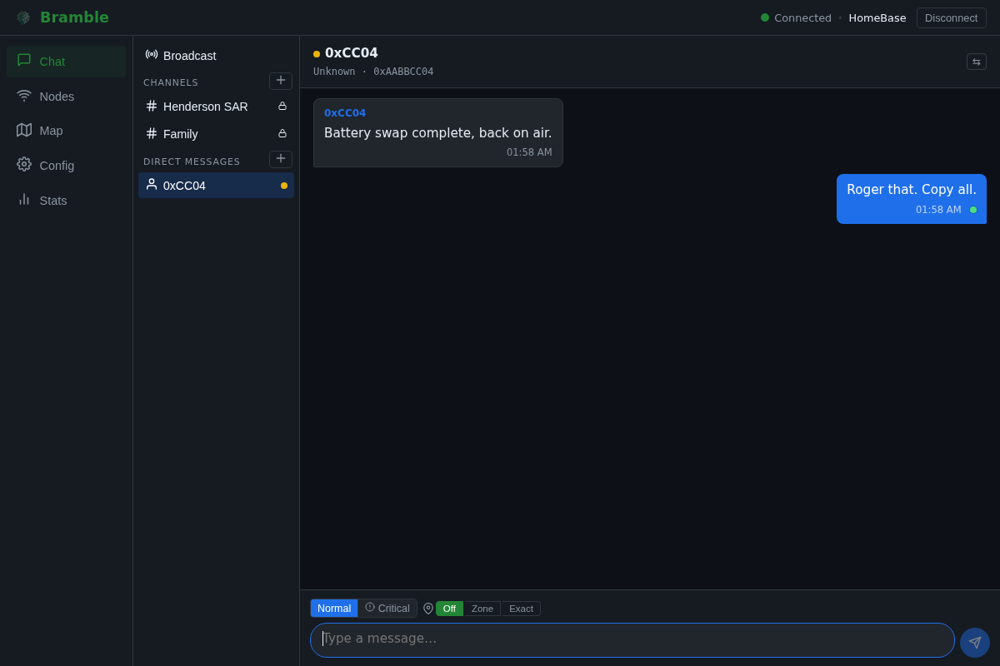
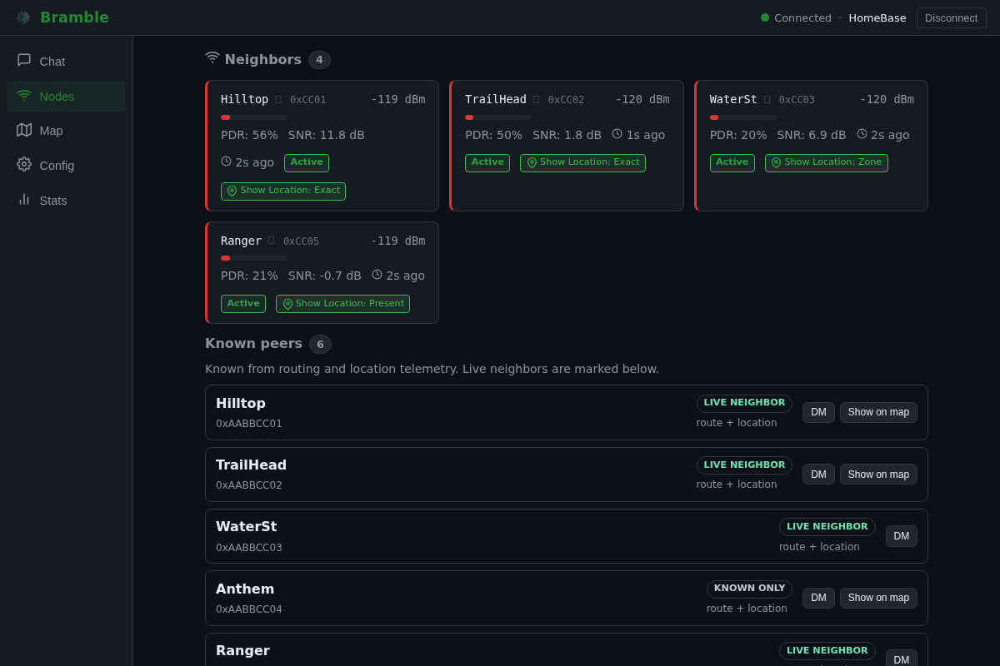
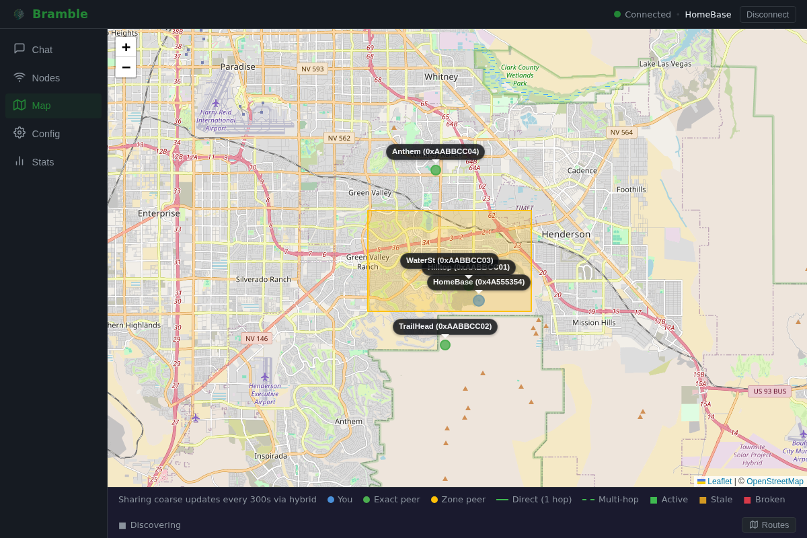
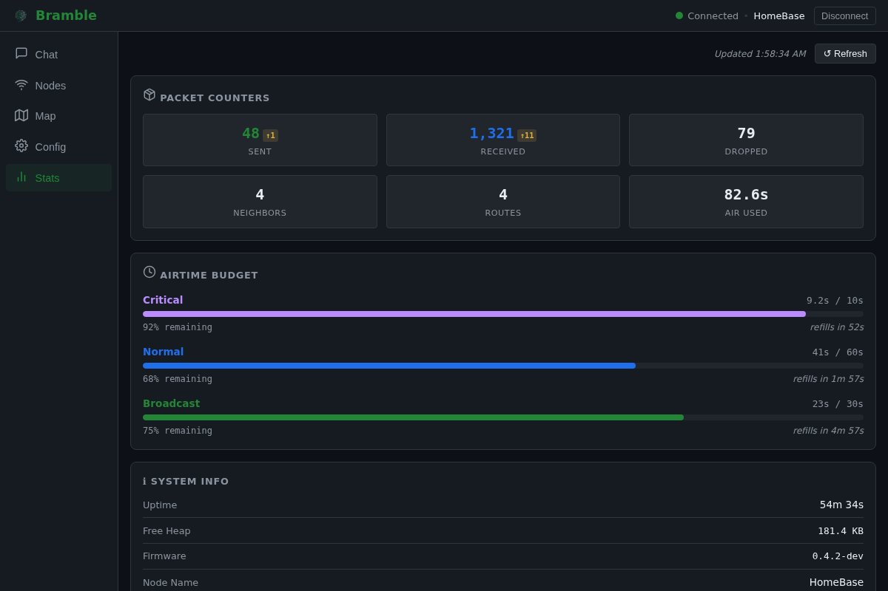
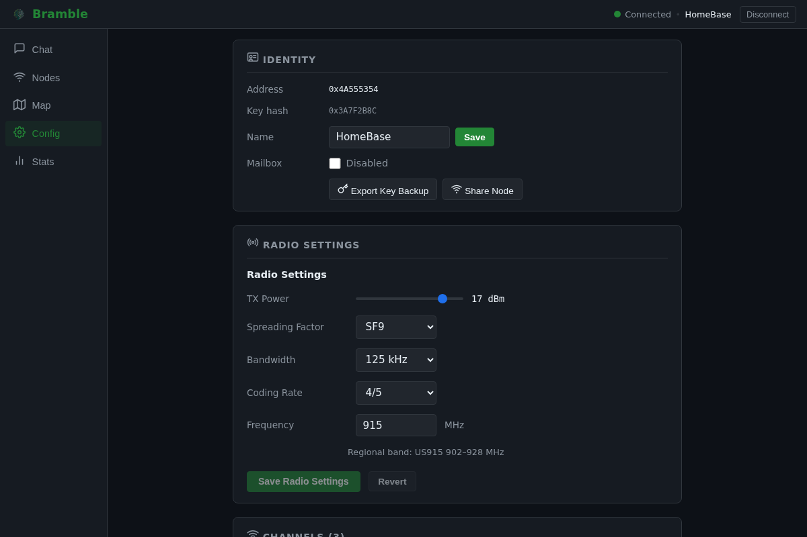

# Bramble

Privacy-first LoRa mesh networking for ESP32-S3, built with ESP-IDF.

Bramble is an encrypted, multi-hop mesh protocol and firmware stack for long-range, infrastructure-free communication. It is designed for resilient field use while reducing metadata exposure; [docs/SECURITY-MODEL.md](docs/SECURITY-MODEL.md) documents exactly what is and is not protected.

## Table of Contents

- [What is Bramble?](#what-is-bramble)
- [What Makes Bramble Different](#what-makes-bramble-different)
- [Web Client](#web-client)
- [Hardware Targets](#hardware-targets)
- [Simulator](#simulator)
- [Getting Started](#getting-started)
- [Testing](#testing)
- [Architecture](#architecture)
- [Documentation](#documentation)
- [API and SDK](#api-and-sdk)
- [CI/CD](#cicd)
- [Status](#status)
- [License](#license)

## What is Bramble?

Bramble is a secure LoRa mesh protocol and firmware implementation for ESP32-S3 devices with SX1262 radios. It focuses on practical private communications in constrained, lossy RF environments, with explicit handling for routing, retransmission, airtime limits, and node identity.

The firmware currently runs on real hardware (including T-Deck Plus and Heltec V3/V4 targets), with host-side testing used to validate protocol behavior continuously during development.

## What Makes Bramble Different

Compared to Meshtastic and MeshCore-style systems, Bramble leans on privacy and on authenticated, confirmable delivery at the protocol level. It is pre-alpha and has not been field-tested at scale; the claims below are what the code on `main` does, with the honest limits stated alongside.

- **Dual-substrate routing.** Two forwarding substrates ship, and a runtime toggle (`s_flood_transport`, default off) selects between them. **Reactive AODV is the default:** RREQ/RREP discovery, a cached route table, reverse-route breadcrumbs learned from DATA, intermediate-node RREP, and route-forwarded ACKs. DM airtime is `O(path_length)`, not `O(N)`. **Flooding is the opt-in alternative:** hop-limited (configurable, default 8, range 1..32), deduplicated, airtime-budget-gated unicast/channel floods with a flooded ACK for route-free sender confirmation. Reactive is not going away; the toggle picks one.
- **Authenticated traffic (wire v4), no insecure bootstrap.** DATA frames and the control plane (RREP, RERR, ACK, delivery receipt, beacon) carry a network-key HMAC that relays verify before acting; a captured frame cannot be forged or replayed by an outsider on a provisioned network. There is no public default key: an unprovisioned node is inert (fail-closed) and refuses to emit or accept any authenticated frame until a real per-fleet key is provisioned (minted on-device or pasted in). Residual: any network-key holder is an insider and can still forge these MACs, narrowed by per-node identity rather than by provisioning ([docs/SECURITY-MODEL.md](docs/SECURITY-MODEL.md)).
- **Confirmed delivery.** Acknowledged tiers report DELIVERED vs FAILED to the sender rather than fire-and-forget. Honest envelope: reactive holds confirmed delivery at small, dense scale; the flooded confirmation holds at low-to-moderate message load and **degrades at high load** because flood airtime scales as `O(messages x nodes)`. It is explicitly not a high-load guarantee.
- **End-to-end direct messages.** DMs use per-peer AES-256-GCM sessions keyed by a role-symmetric quad-DH X25519 exchange (`components/dm_session`), with a 7-digit SAS for out-of-band verification. They are not readable by other channel members. No forward secrecy yet; the SAS-comparison UX does not ship yet ([docs/SECURITY-MODEL.md](docs/SECURITY-MODEL.md)).
- **Channel encryption + multi-hop channels.** Channel messages use AES-256-GCM (AEAD) with the channel ID hidden inside the ciphertext, and they now relay multi-hop via the flood relay rather than being single-hop only.
- **Privacy-first routing.** Route-request sources are pseudonymized per query, so forwarded route requests do not carry the originator's address.
- **Airtime budgeting:** every transmission goes through one budget-gated TX path (`components/radio/tx_gate.c`) with real time-on-air costing, per-tier token buckets, and regional duty-cycle caps enforced where the frequency plan requires them (for example EU 868 at 1%).
- **3-tier reliability model:** Broadcast (fire-and-forget), Normal (acknowledged, 3 retries with backoff), and Critical (8 retries plus delivery receipts carrying the relay path).
- **Cryptographic node identity:** X25519-derived 4-byte addresses provide stable identity primitives. Note there is no per-node signature or trust anchor, so Sybil/impersonation across the fleet is not closed.
- **Store-and-forward mailbox:** offline nodes receive queued messages when they rejoin the mesh.
- **Location sharing with privacy tiers:** presence, zone (coarse ~1km), or exact; per-peer control over what you share and with whom. Location payloads are now AES-256-GCM encrypted end to end and padded to a fixed size so the ciphertext does not leak which tier was chosen; timing and the fact that a node shares location remain observable ([docs/SECURITY-MODEL.md](docs/SECURITY-MODEL.md)).
- **Browser-based flashing:** flash firmware to new devices directly from the web, no toolchain required.

For a deeper feature-by-feature analysis, see [docs/COMPARISON.md](docs/COMPARISON.md).

## Web Client

Bramble includes a web client for live network operation and monitoring. It provides real-time chat (including delivery badges), map-based peer location views, neighbor and route visualization, traffic monitoring, channel management, and radio configuration.







See [docs/webapp/chat.md](docs/webapp/chat.md) for current web client behavior and usage notes.

## Hardware Targets

| Board | MCU | Display | Input | Radio | Audio | Status |
|------|-----|---------|-------|-------|-------|--------|
| Heltec WiFi LoRa 32 V3 | ESP32-S3 | 0.96" SSD1306 OLED (128x64) | Buttons | SX1262 | N/A | Running target |
| Heltec WiFi LoRa 32 V4 | ESP32-S3 | OLED + optional L76K GNSS | Buttons | SX1262 | N/A | Running target (active bring-up) |
| LilyGo T-Deck Plus | ESP32-S3 | ST7789 320x240 LCD with LVGL v9 UI | GT911 capacitive touch + I2C keyboard | SX1262 with TCXO (DIO3 1.8V, DC-DC) | I2S with NVS-persisted volume | Running target with full GUI |

## Simulator

Bramble ships with a mesh simulator that runs real protocol code against a virtual radio layer and renders topology/traffic in a browser. The radio layer models the shared LoRa medium (real time-on-air, collisions, capture, half-duplex, listen-before-talk), making it the primary proving ground for scale and routing behavior before field deployment.

See [simulator/README.md](simulator/README.md) for setup and scenarios. For measured scale results under the collision model, [docs/results/simulation-2026-07-honest-baseline.md](docs/results/simulation-2026-07-honest-baseline.md) is the current source of truth (it supersedes the June numbers for planning; the earlier collision-free "100% at 200 nodes" figures were retracted as sim artifacts). In short: about 95% delivery at 10 nodes, collapsing to roughly 10-12% at 50-100 nodes and 0% at 200 as a single SF10 channel saturates under control-plane load. Scale is bounded by radio profile, node density, and hop budget; there is no field-tested-at-scale result.

## Getting Started

Full build/flash instructions (including board-specific profiles and USB-port notes) are in [docs/BUILDING.md](docs/BUILDING.md).

Quick start:

```bash
cd ~/src/bramble
bash scripts/flash.sh local heltec-v3 build
bash scripts/flash.sh local heltec-v3 flash /dev/ttyUSB0
```

Use `tdeck-plus` instead of `heltec-v3` for T-Deck Plus builds.

## Testing

Host-side tests cover crypto, routing, security, packet handling, reliability, and integration behavior.

```bash
cd test
./run_all_tests.sh
```

## Architecture

Bramble is organized as ESP-IDF components with clear boundaries between protocol logic, radio abstraction, security, reliability, and UI/control layers. The architecture is designed so core protocol behavior can be validated on host and simulator environments before device rollout.

For the full component breakdown and interaction diagrams, see [docs/bramble-architecture.md](docs/bramble-architecture.md).

## Documentation

- [docs/README.md](docs/README.md): documentation index (recommended entry point)
- [docs/BUILDING.md](docs/BUILDING.md): build, flash, monitor workflows
- [docs/bramble-architecture.md](docs/bramble-architecture.md): component-level architecture
- [docs/SECURITY-MODEL.md](docs/SECURITY-MODEL.md): threat model, verified protections, and known gaps
- [docs/auth.md](docs/auth.md): RPC authentication (on by default), pairing, and the browser origin allowlist
- [docs/COMPARISON.md](docs/COMPARISON.md): comparison with other mesh systems
- [docs/bramble-protocol-spec.md](docs/bramble-protocol-spec.md): protocol details
- [docs/bramble-testing.md](docs/bramble-testing.md): test strategy and coverage
- [docs/ota-rollout.md](docs/ota-rollout.md): OTA operator workflow
- [docs/quality-policy.md](docs/quality-policy.md): repo-wide CI gates, promotion criteria, and rollback levers
- [docs/quality-policy-firmware.md](docs/quality-policy-firmware.md): firmware lint/static-analysis phased rollout and advisory CI mapping
- [docs/quality-policy-webapp.md](docs/quality-policy-webapp.md): webapp workflow required/advisory mapping, local parity commands, and rollback levers
- [simulator/README.md](simulator/README.md): simulator usage
- [docs/webapp/chat.md](docs/webapp/chat.md): web client chat and UX notes

## API and SDK

Bramble exposes a JSON-RPC 2.0 interface for device control and observability.

- [api/openapi.yaml](api/openapi.yaml): OpenAPI spec for the RPC surface (synced to the firmware registry, CI-enforced by `scripts/check-rpc-contract.sh`; see [VERSIONING.md](VERSIONING.md))
- [bramble-go](https://git.idiotica.org/dumbot/bramble-go): Go SDK (serial, WebSocket, BLE)
- [bramble-cli](https://git.idiotica.org/dumbot/bramble-cli): CLI/TUI built on bramble-go
- [VERSIONING.md](VERSIONING.md): compatibility matrix

## CI/CD

- [.gitea/workflows/webapp-quality.yml](.gitea/workflows/webapp-quality.yml) runs webapp required gates (lint/typecheck/unit/build/e2e smoke).
- [.gitea/workflows/webapp-build-publish.yml](.gitea/workflows/webapp-build-publish.yml) builds/tests/publishes the web client image.
- [.gitea/workflows/firmware-quality.yml](.gitea/workflows/firmware-quality.yml) runs firmware quality gates (Phase 2.3): required clang-format/shellcheck/actionlint plus advisory clang-tidy/markdownlint.
- Additional workflow definitions live in [.gitea/workflows](.gitea/workflows).

## Status

Bramble is **pre-alpha**, but active and running on real hardware today (including T-Deck Plus, Heltec V3, and Heltec V4 bring-up). The protocol stack is implemented end-to-end, and every change must pass the full host test suite as a required CI gate (`test/run_all_tests.sh`, which fails if any suite fails or none are found). Development is ongoing.

## License

MIT; see [LICENSE](LICENSE)
