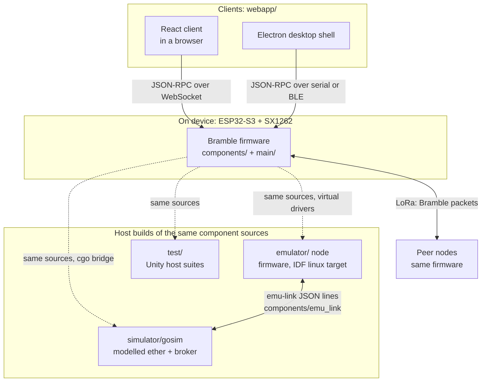
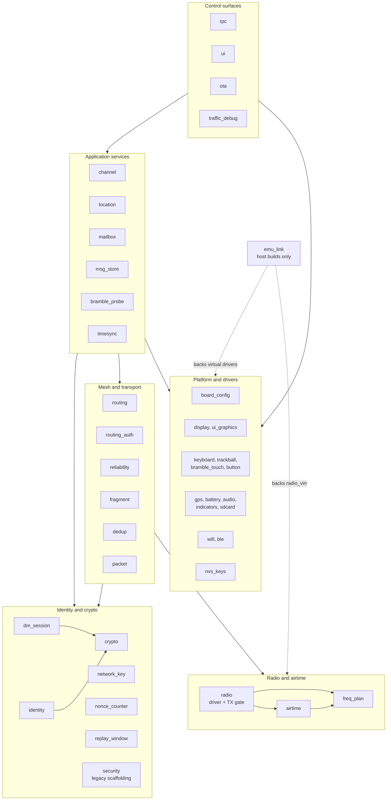
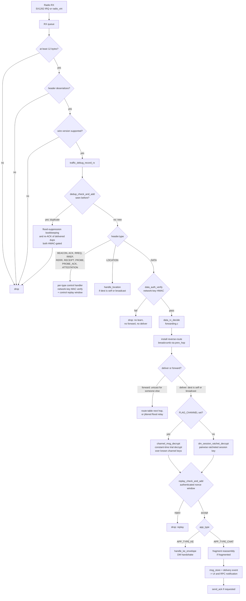

# Bramble Architecture

A technical reference for the Bramble LoRa mesh networking protocol stack.

---

## Overview

Bramble is a privacy-first LoRa mesh networking protocol targeting ESP32-S3 + SX1262 hardware. It provides encrypted, multi-hop communication without central infrastructure. Message payloads on configured channels are encrypted with AES-256-GCM, route-request sources are pseudonymized, and the channel a message belongs to is hidden inside the ciphertext. There are no pairwise end-to-end keys today, and several control-plane packets are unauthenticated; [SECURITY-MODEL.md](SECURITY-MODEL.md) is the authoritative statement of what is and is not protected.

The codebase is organized as ESP-IDF components. Each component is self-contained with a clean public API exposed through its `include/` header. Components depend on each other only through these interfaces: there are no circular dependencies.

See also:

- [`docs/COMPARISON.md`](COMPARISON.md): Comparison with Meshtastic and MeshCore
- [`docs/bramble-anomaly-detection.md`](bramble-anomaly-detection.md): Anomaly detection subsystem
- [`simulator/README.md`](../simulator/README.md): Network simulator
- [`emulator/DESIGN.md`](../emulator/DESIGN.md): Emulator and the emu-link broker protocol

---

## System View

Four things build from one set of C sources. The firmware in `components/` plus `main/` is the only implementation of the protocol; the simulator, the emulator, and the host test suites all compile those same component sources rather than reimplementing them, which is why a protocol change cannot pass CI in one place and silently drift in another.



The three RPC transports are not equivalent in trust: WebSocket and BLE require a token by default, and serial is the unauthenticated pairing bootstrap that issues one. See [auth.md](auth.md) and the JSON-RPC section below.

---

## Design Goals

1. **Privacy by design**: Source addresses, channel IDs, and routing metadata are hidden from relay nodes and passive observers wherever possible.
2. **Scalability**: Reactive (on-demand) routing for unicast DMs; controlled flood routing for channels. O(path_length) transmissions per DM after route discovery, not O(N).
3. **Airtime discipline**: Token-bucket duty cycle enforcement prevents channel monopolization and ensures regulatory compliance.
4. **Tiered reliability**: Applications choose between fire-and-forget, acknowledged, and critical delivery; each tier has appropriate retry and flow-control behavior.
5. **Embedded constraints**: Integer-only arithmetic, static allocation, no heap after init, minimal RAM footprint (~127 KB total).

---

## Component Map

| Component | Path | Purpose |
| ----------- | ------ | --------- |
| `crypto` | `components/crypto/` | AES-256-GCM, X25519, HKDF |
| `packet` | `components/packet/` | Packet framing, serialization, type definitions |
| `routing` | `components/routing/` | AODV route discovery, forwarding, beacon, route maintenance, route metrics |
| `channel` | `components/channel/` | Named group channels (key derivation, message encrypt/decrypt, public channel) |
| `security` | `components/security/` | Legacy session/key-exchange scaffolding and dummy traffic (not the shipping DM path: see `dm_session`) |
| `dm_session` | `components/dm_session/` | The shipping DM crypto: quad-DH handshake, session table, symmetric double ratchet, SAS |
| `network_key` | `components/network_key/` | Shared network key provisioning and storage |
| `nonce_counter` | `components/nonce_counter/` | Monotonic per-node AEAD nonce counter with NVS boundary flush |
| `replay_window` | `components/replay_window/` | Per-sender authenticated replay window and deferred acceptance |
| `routing_auth` | `components/routing_auth/` | Network-key MACs on control-plane packets (RREP, RERR, ACK, receipts, beacons) |
| `indicators` | `components/indicators/` | LED, buzzer, and vibration alert output |
| `reliability` | `components/reliability/` | ACKs, retransmission, delivery receipts |
| `fragment` | `components/fragment/` | Message fragmentation and reassembly |
| `airtime` | `components/airtime/` | Duty cycle tracking and TX priority queue |
| `dedup` | `components/dedup/` | Duplicate packet detection (sliding-window bloom filter) |
| `identity` | `components/identity/` | Node identity: Ed25519 + X25519 keypair generation, storage, attestations, trust anchor |
| `timesync` | `components/timesync/` | Stratum-based mesh time synchronization |
| `radio` | `components/radio/` | SX1262 driver, airtime math, and the budget-gated TX gate (single transmit path) |
| `mailbox` | `components/mailbox/` | Store-and-forward buffer for offline destinations |
| `location` | `components/location/` | Private location sharing with tiered privacy |
| `msg_store` | `components/msg_store/` | Message persistence (SPIFFS-backed message history) |
| `audio` | `components/audio/` | Audio playback (tones, alerts) |
| `battery` | `components/battery/` | Battery voltage monitoring and reporting |
| `gps` | `components/gps/` | GPS/GNSS driver and NMEA parser |
| `wifi` | `components/wifi/` | Wi-Fi station/AP mode management |
| `sdcard` | `components/sdcard/` | SD card storage driver |
| `bramble_probe` | `components/bramble_probe/` | Network reachability probe sweep |
| `freq_plan` | `components/freq_plan/` | Regional regulatory policy table: bands, TX power ceilings, duty-cycle caps |
| `nvs_keys` | `components/nvs_keys/` | Central NVS namespace/key registry |
| `rpc` | `components/rpc/` | JSON-RPC dispatcher, method registration, and auth policy (default-on token, unauthenticated allowlist, notification gating) |
| `traffic_debug` | `components/traffic_debug/` | Runtime TX/RX traffic capture and airtime attribution telemetry |
| `board_config` | `components/board_config/` | Per-board hardware capability definitions |
| `display` | `components/display/` | OLED status display (hardware-dependent) |
| `ble` | `components/ble/` | BLE interface + key backup (hardware-dependent) |
| `ota` | `components/ota/` | Signed OTA updates: image signature verification, origin allowlist, soft anti-rollback (hardware-dependent) |
| `ui` | `components/ui/` | JSON-RPC control interface |
| `ui_graphics` | `components/ui_graphics/` | LVGL-based GUI (T-Deck Plus: chat, nodes, settings screens) |
| `keyboard` | `components/keyboard/` | T-Deck Plus I2C keyboard driver (ESP32-C3 sub-MCU) |
| `trackball` | `components/trackball/` | T-Deck Plus hall-effect trackball driver |
| `bramble_touch` | `components/bramble_touch/` | T-Deck Plus touchscreen driver |
| `button` | `components/button/` | Physical button input handling |
| `emu_link` | `components/emu_link/` | Host-only emu-link broker client (emulator builds only; no device implementation) |

### Component Groups

Forty-three boxes is a list, not a diagram. Grouped by the layer each component serves, the shape of the stack is easier to hold. Arrows show the direction of dependency, not packet flow.



Components depend on each other only through their `include/` headers, and there are no circular dependencies. `emu_link` is drawn apart because it compiles to a stub on `esp32s3` builds: it exists only for the emulator and host tests.

---

## JSON-RPC API Notes (Current Firmware)

The runtime source of truth for available RPC methods is `main/rpc_methods.c`.
The OpenAPI document (`api/openapi.yaml`) is kept in sync with that registry,
enforced in CI by `scripts/check-rpc-contract.sh`.

Access control (see [auth.md](auth.md) and [SECURITY-MODEL.md](SECURITY-MODEL.md)):

- Auth is required by default on WebSocket and BLE; serial is the unauthenticated pairing bootstrap.
- Unauthenticated connections may call only `bramble.ping` and `bramble.getVersion` (`components/rpc/rpc_auth.c`) and receive no server-push notifications.
- Tokenless browser connections are subject to a WebSocket `Origin` allowlist (`main/ws_origin.c`, enforced in `main/ws_server.c`).

Notable wire-format details clients must honor:

- `bramble.getAirtime` returns flat fields (`critical_remaining_ms`, etc.)
- `bramble.sendMessage` returns `packetId` as a hex string
- `bramble.setRadio` expects snake_case keys (`frequency_mhz`, `bw_hz`, `tx_power_dbm`, `coding_rate`)
- location contact methods use `address` as 8-char hex string

---

## Packet Format

### Common Header (12 bytes)

All Bramble packets begin with a 12-byte header:

```text
Offset  Size  Field
0       1     version   (always 0x01)
1       1     type      (PKT_TYPE_*)
2       1     flags     (see Flag Bits below)
3       1     hop_limit (decremented at each relay; drop at 0)
4       4     dest_addr (destination node address; 0xFFFFFFFF = broadcast)
8       4     packet_id (random ID for dedup and ACK matching)
```

All multi-byte fields are **big-endian** (network byte order; `put_be32`/`get_be32` in `components/packet/packet.c`).

### Flag Bits (header byte 2)

| Bits | Mask | Name | Meaning |
| ------ | ------ | ------ | --------- |
| 7 | `0x80` | `FLAG_RESERVED_HIGH` | Reserved, not used |
| 6 | `0x40` | `FLAG_EMERGENCY` | Reserved for future use: origin-set, immutable, AAD-bound. No emergency feature ships today |
| 5 | `0x20` | `FLAG_ACK_REQ` | Sender requests an end-to-end ACK |
| 4 | `0x10` | `FLAG_RECEIPT` | Sender requests a delivery receipt with relay path |
| 3 | `0x08` | `FLAG_CHANNEL` | Selects the decrypt mechanism: set means channel-key trial decryption, absent means a pairwise DM session |
| 2 | `0x04` | `FLAG_ENCRYPT` | Payload is encrypted |
| 1–0 | `0x03` | `FLAG_FRAG_MASK` | Fragment indicator (00=none, 01=first, 10=middle, 11=last) |

There is no `FLAG_TIER`. Bits 7 and 6 were freed in wire v2 when the reliability tier moved into the ciphertext, and they are two separate reserved flags today (`components/packet/include/packet.h`).

### Packet Types

| Value | Name | Description | Size |
| ------- | ------ | ------------- | ------ |
| `0x01` | `PKT_TYPE_ACK` | End-to-end acknowledgement | 37–69 bytes |
| `0x02` | `PKT_TYPE_RREQ` | Route Request (AODV route discovery) | 30 bytes |
| `0x03` | `PKT_TYPE_RREP` | Route Reply | 40 bytes |
| `0x04` | `PKT_TYPE_RERR` | Route Error (broken link notification) | 38 bytes |
| `0x05` | `PKT_TYPE_BEACON` | Node status beacon | 54 bytes |
| `0x06` | `PKT_TYPE_KEY_EXCHANGE` | Retired from the wire in v2. DM handshakes ride `DATA` envelopes with `app_type == APP_TYPE_KE`; the constant survives only so legacy references compile | n/a |
| `0x07` | `PKT_TYPE_DELIVERY_RECEIPT` | Path-tracing delivery receipt | 36–68 bytes |
| `0x0A` | `PKT_TYPE_DATA` | Encrypted data payload | variable |
| `0x0B` | `PKT_TYPE_STORE_REQUEST` | Request a mailbox node to store a message | variable |
| `0x0C` | `PKT_TYPE_STORE_ACK` | Acknowledgement of successful mailbox storage | fixed |
| `0x0D` | `PKT_TYPE_MAILBOX_DELIVERY` | Delivery of stored message to now-online destination | variable |
| `0x0E` | `PKT_TYPE_MAILBOX_QUERY` | Query a mailbox node for messages | fixed |
| `0x12` | `PKT_TYPE_PROBE` | Network reachability probe | variable |
| `0x13` | `PKT_TYPE_PROBE_ACK` | Probe acknowledgement | variable |
| `0x14` | `PKT_TYPE_LOCATION` | Location sharing packet | variable |
| `0x15` | `PKT_TYPE_IDENTITY_ATTESTATION` | Signed identity attestation | 230 bytes |

Sizes reflect wire version 5 (`BRAMBLE_VERSION` in `components/packet/include/packet.h`). Every control-plane packet carries a 48-bit origin sequence for replay protection (ws 1.3b). Version 5 was a DM forward-secrecy flag day: DM and `LOCATION` session payloads now carry a 3-byte cleartext ratchet header (`epoch || msg_index`, authenticated through the AEAD AAD) and are keyed per message by the ratchet. The RX version gate is an exact match, so v4 frames are dropped and the peer re-handshakes.

Implementation status: the mesh RX dispatcher (`mesh_process_rx_packet` in `main/mesh_task.c`) currently handles `ACK`, `RREQ`, `RREP`, `RERR`, `BEACON`, `DELIVERY_RECEIPT`, `DATA`, `LOCATION`, `PROBE`, `PROBE_ACK`, and `IDENTITY_ATTESTATION`. The four mailbox types are defined but never sent or handled. `KEY_EXCHANGE` (`0x06`) is retired from the wire, but key exchange itself is very much live: it is transported inside `DATA` envelopes (see the `dm_session` section). Type codes `0x08`, `0x09`, `0x0F`, `0x10`, and `0x11` (formerly `CONGESTION`, `TIME_SYNC`, `EMERGENCY`, `EMERGENCY_CANCEL`, and `CODED`) are retired: that machinery was deleted unshipped. Mailbox store-and-forward works without its dedicated packet types: relays store undeliverable `DATA` packets and flush them when the destination's beacon is heard.

### Beacon Flags

The `bramble_beacon_t.flags` field carries per-feature capability bits:

| Bit | Name | Meaning |
|-----|------|---------|
| 0 | `BEACON_FLAG_MAILBOX` | Node is willing to store messages for offline peers |
| 1 | `BEACON_FLAG_PROBE_ACK` | Node will answer reachability probes (defined in `components/bramble_probe/include/bramble_probe.h`) |

---

## Packet Path (Receive)

Every inbound frame walks the same funnel in `mesh_process_rx_packet` (`main/mesh_task.c`): cheap structural checks first, then dedup, then per-type dispatch, and only then anything expensive like decryption. The ordering is deliberate, and two properties of it are load-bearing.

First, `DATA` frames are authenticated with the network-key HMAC (`data_auth_verify`) **before** the node learns a reverse route from them or forwards them. A relay never decrypts `DATA`, so the AEAD tag cannot gate the forwarding decision; the HMAC is what stops a keyless attacker from poisoning route tables toward a spoofed victim.

Second, the dedup gate sits before dispatch, so the duplicate branch is the only place a node can count the other relays it overhears. That branch is where flood-rebroadcast suppression and the re-ACK of an already-delivered duplicate happen, and both are themselves gated on the HMAC so a garbage-MAC replay cannot cancel a genuine relay.



`LOCATION` frames carry their own envelope and are decrypted by `handle_location` rather than the `handle_data` path drawn above, but they use the same AAD construction and the same authenticated replay window.

---

## Component Reference

### `crypto`

**Files:** `crypto_esp.c` (hardware AES on ESP32-S3), `crypto_host.c` (mbedTLS for host tests), `crypto_entropy.c`

Provides the cryptographic primitives used throughout the stack:

- **AES-256-GCM**: `crypto_aes256gcm_encrypt` / `_decrypt`: AEAD with 12-byte nonce, 16-byte auth tag
- **X25519**: `crypto_x25519`: Diffie-Hellman key exchange
- **HKDF-SHA256**: `crypto_hkdf`: Key derivation from shared secrets and context strings
- **Random**: `crypto_random`: Cryptographically secure random bytes

Key sizes: `BRAMBLE_KEY_SIZE` = 32 bytes, `BRAMBLE_NONCE_SIZE` = 12 bytes, `BRAMBLE_TAG_SIZE` = 16 bytes.

---

### `packet`

**Files:** `packet.c`

Defines all packet structs and provides serialize/deserialize functions for each packet type. Serialization is always to/from raw byte arrays (no protobuf, no dynamic allocation). All functions return `ESP_OK` on success or `ESP_ERR_INVALID_SIZE` if the buffer is too small.

The `bramble_header_t` struct maps directly onto the 12-byte on-wire format. Higher-level structs (e.g., `bramble_beacon_t`, `bramble_rreq_t`) embed the header as their first field.

---

### `routing`

**Files:** `beacon.c`, `channel_flood.c`, `discovery.c`, `forwarding.c`, `routing.c`

Implements AODV-inspired reactive unicast routing:

1. **Route discovery** (`discovery.c`): Broadcasts RREQ with encrypted source address; destination unicasts RREP along reverse path. Expanding-ring search: hop limit 4 on the first attempt (`RREQ_HOP_LIMIT_INITIAL`) and 8 on both retries (`RREQ_HOP_LIMIT_EXPANDED` = `ROUTE_HOP_LIMIT_MAX`), at +5 s and +15 s, each retry under a fresh query_id so dedup on nodes that heard an earlier attempt cannot swallow it. Relays delay RREQ rebroadcasts by a random 50-300 ms so same-hop relays do not collide with each other. Cached routes go stale after 300 s of inactivity and are evicted at 600 s (`ROUTE_ACTIVE_TIMEOUT_MS` / `ROUTE_STALE_TIMEOUT_MS`).
2. **Forwarding** (`forwarding.c`): Looks up next-hop from route table; decrements `hop_limit`; emits RERR on unknown destination.
3. **Beacons** (`beacon.c`): Periodic 60s neighbor discovery beacons carrying node status, public key hash, HMAC'd with pairwise session key for known peers.
4. **Route metric** (`routing.c`): penalty-accumulating link metric (RSSI/SNR), first-arrival selection within a flood, better-metric arbitration between discovery attempts at `route_install`.

Privacy note: RREQ packets encrypt the source address: intermediate relay nodes cannot determine who initiated a route discovery.

---

### `channel`

**Files:** `channel_key.c`, `channel_msg.c`, `public_channel.c`

Provides named encrypted group channels:

- **Key derivation** (`channel_key.c`): Derives a 32-byte AES key from a PSK string using HKDF. Epoch-based key ratchet: `channel_advance_epoch()` advances the key to provide backward secrecy (old keys are deleted after ratchet).
- **Message encrypt/decrypt** (`channel_msg.c`): Inner plaintext structure includes `channel_id(1) + epoch(2) + app_type(1) + src_addr(4)` prepended to user data before AES-256-GCM encryption. The channel ID and source address are therefore hidden from non-members. Trial decryption tries all known channels in constant time to prevent timing side-channels; epoch catch-up tries up to 256 epoch advances per channel.
- **Public channel** (`public_channel.c`): See dedicated section below.

**Bug fix (2026-02-17):** `channel_msg_decrypt` had a pointer bug where `found_info.data` was set to `ciphertext + CHANNEL_MSG_OVERHEAD` instead of `pt + CHANNEL_MSG_OVERHEAD`. This caused the caller to receive a pointer into the ciphertext buffer rather than the decrypted plaintext. Fixed by re-decrypting the winning channel after the constant-time loop and copying the plaintext data portion back into the ciphertext buffer (which the caller owns), then setting `found_info.data` to `NULL` to indicate the catchup path, and re-decrypting once more in the normal path.

---

### `security`

**Files:** `security.c`, `dummy_traffic.c`

Manages session keys and the 3-step key exchange:

1. **Initiate**: Alice sends `PKT_TYPE_KEY_EXCHANGE` with ephemeral X25519 pubkey
2. **Respond**: Bob sends his ephemeral + long-term pubkeys
3. **Confirm**: Alice sends final auth tag proving she holds the derived session key

Session key = HKDF(ephemeral-DH ‖ static-DH, "bramble-session"). Keys rotate every 24h or 65,536 messages.

Implementation status: **this component is not the shipping DM path.** It is earlier scaffolding, kept for its dummy-traffic code and host tests. `PKT_TYPE_KEY_EXCHANGE` is retired from the wire, and nothing calls this component's session machinery in the live firmware. Direct messages are keyed by `components/dm_session/` instead: a quad-DH handshake carried inside `DATA` envelopes, followed by a symmetric double ratchet. See the `dm_session` section below, and [SECURITY-MODEL.md](SECURITY-MODEL.md) for the authoritative threat model.

**Dummy traffic** (`dummy_traffic.c`): Cover-traffic scheduler (random-length packets at random intervals to defeat volume/timing correlation). Component-level only: nothing in the firmware schedules it today (see SECURITY-MODEL.md); it is the building block for a planned quiet-mode cover-traffic feature.

---

### `dm_session`

**Files:** `dm_session.c`

Owns all direct-message cryptography: the pairwise handshake, the session table, and the per-message double ratchet. This is the component that actually keys DMs today; `security` above is not.

**Handshake.** Two messages, `KE_TYPE_INIT` and `KE_TYPE_RESP`, carried inside `DATA` envelopes with `app_type == APP_TYPE_KE` under the channel key. The channel key is the handshake *transport* only, used because no pairwise session exists yet. `dm_compute_ikm` derives a 128-byte input keying material from a quad-DH over both parties' identity and ephemeral X25519 keys. The responder's `RESP` carries a real key confirmation, `HMAC(K_confirm, transcript_2)[0:16]`. On first contact the initiator's `INIT` proves nothing (its auth tag is zeroed) and the initiator is authenticated later; on rekey with a known peer the `INIT` tag is `HMAC(K_ke_init, transcript_1)[0:16]`.

**Pin continuity.** A node address derives from the Ed25519 identity key, so an X25519 key cannot prove an address by hashing. Instead, when the identity store holds an attestation-verified X25519 pin for a peer, both `dm_verify_init` and `dm_verify_resp` require the presented `long_term_pubkey` to match it byte for byte, failing with `DM_VERIFY_ERR_PIN_MISMATCH`. With no pin, the exchange proceeds TOFU-grade: the first-contact window is unauthenticated until the peer's attestation is heard and pinned. That residual is stated, not hidden.

**Session table.** `DM_MAX_SESSIONS` = 32 slots with state-priority LRU. At most `DM_MAX_HANDSHAKING` = 8 slots may be mid-handshake, which bounds a spoofed-INIT flood. Only a *verified* active session is protected from eviction; an unverified active session is evictable under pressure, LRU-ordered by `last_active_ms`. That asymmetry is deliberate: first-contact INITs reach active/unverified without touching the handshaking cap, so protecting them unconditionally would let forged identities fill the table and permanently block DM establishment.

**Ratchet.** `dm_ratchet_init` derives an epoch-0 root key plus two directional chain keys, domain-separated by address ordering, so the lower-addressed party sends on one chain and receives on the other. `dm_ratchet_step` derives message key `mk_n` and the next chain key; `mk_n` encrypts exactly one AES-256-GCM message and is then wiped. Epoch 0 is bit-identical to the pre-ratchet session key, which is what made the migration continuous.

**Wire framing.** Each ratcheted frame carries a 3-byte cleartext header, `epoch || msg_index` big-endian, ahead of the ciphertext. Those 3 bytes are fed into the AEAD AAD, so they are authenticated but not encrypted. Because the receiver reads the index before decrypting, key selection is known up front: there is exactly one derivation and one GCM decrypt, and no trial-decryption loop.

**Loss tolerance.** A bounded skip cache absorbs out-of-order and lost LoRa frames. `DM_MAX_SKIP` = 16 is both the forward-derive bound and the cache size; it is a loss-tolerance and RAM tuning constant, not a security boundary. An index beyond `next + DM_MAX_SKIP` is refused *without* deriving anything (`DM_DECRYPT_TOO_FAR`, the DoS bound) and the caller degrades to a desync-heal re-handshake. Replay defense is not this layer's job: the authoritative check is the per-sender authenticated nonce window, consulted first. The ratchet index is an ordering aid, not a second replay oracle.

**Epoch bump.** `dm_session_epoch_bump` folds a fresh X25519 output into the current root, giving post-compromise recovery at epoch granularity. The previous epoch's receive chain and skip cache are retained for a grace window of `DM_EPOCH_GRACE_MSGS` = 16 new-epoch messages so in-flight old frames still decrypt; wiping them at the end of that window is what actually delivers the recovery property. A lost or failed rekey leaves both sides on the current epoch, so no message is stranded.

**Safety numbers.** Two distinct SAS derivations exist and they are not interchangeable. `dm_derive_sas` commits to the session IKM and therefore changes on every re-handshake. `dm_derive_identity_sas` renders a stable 7-digit fingerprint of the two peers' pinned X25519 identity keys, ordered by address so both sides compute the same string; it is stable across ratchet steps, epoch bumps, desync heals, and reboots. It is public-key material, a fingerprint like a Signal safety number, not a secret.

---

### `reliability`

**Files:** `reliability.c`

Three delivery tiers:

| Tier | Retries | Timeout | Notes |
| ------ | --------- | --------- | ------- |
| Broadcast | 0 | none | Fire-and-forget |
| Normal | 3 | 2s base, exponential backoff with ±25% jitter | End-to-end ACK required |
| Critical | 8 | 3s base, exponential backoff with ±25% jitter | Delivery receipt + full relay path |

(Constants: `tier_max_retries` / `tier_base_delay_ms` in `components/reliability/reliability.c`; jitter applied in `main/mesh_reliability.c`.)

The retry/ACK machinery above is live. A per-destination AIMD sliding window and the CONGESTION packet type were removed unshipped; in-flight traffic is bounded by the 8-entry pending-ACK table and the airtime budget.

---

### `fragment`

**Files:** `fragment.c`

Splits messages larger than the LoRa MTU (~240 bytes usable after header and crypto overhead) into multiple fragments. Fragments share a `packet_id` and are tagged with `FLAG_FRAG` bits (first/middle/last). Reassembly times out after 30s if not all fragments arrive.

---

### `airtime`

**Files:** `airtime_budget.c`

Per-tier token-bucket airtime budget with continuous (proportional) refill, consumed by the radio TX gate:

- **Budget** (`airtime_budget.c`): Four lanes with hourly base budgets of 36 s critical, 18 s normal, 18 s broadcast, and 12 s receipt (`AIRTIME_BUDGET_*_MS`). An adaptive profile scales the maxima by mesh size (`airtime_budget_set_mesh_size`), CRITICAL may borrow a capped share of NORMAL (`AIRTIME_BORROW_CAP_PCT`, 25%), and a regulatory duty-cycle cap from the frequency plan scales everything down when the region enforces one (`airtime_budget_set_duty_cap`; EU868 = 1%). See [airtime-budget-v2.md](airtime-budget-v2.md).

Every transmission is admitted and debited by the TX gate in `components/radio/tx_gate.c` (see the `radio` section); there is no budget-exempt transmit path.

---

### `freq_plan`

**Files:** `freq_plan.c`

The regulatory policy table. It is worth being precise about what this component does and does not do: `freq_plan` holds no state and enforces nothing itself. It is a static table of per-region plans plus pure validation and clamping helpers. Enforcement happens in the components that read it, which is why the duty-cycle story is easy to miss when reading either side alone.

Each `bramble_freq_plan_t` carries a name, the citable regulatory basis, the band start and end, a default frequency, a maximum TX power, a maximum duty cycle percentage, a hard-enforce flag, and default modulation parameters.

| Region | Regulatory basis | Band | Default | Max TX power | Duty cycle | Enforced |
| -------- | ------------------ | ------ | --------- | -------------- | ------------ | ---------- |
| `US915` | FCC Part 15.247 | 902.0–928.0 MHz | 915.0 MHz | 30 dBm | 100% (no limit) | no |
| `EU868` | ETSI EN 300.220 | 863.0–870.0 MHz | 868.1 MHz | 14 dBm | 1% | yes |
| `AU915` | ACMA | 915.0–928.0 MHz | 921.0 MHz | 30 dBm | 100% (no limit) | no |

All three regions default to SF9 and 125 kHz bandwidth. The active region is selected at compile time by `CONFIG_BRAMBLE_REGION_*`, defaulting to `US915`.

**How the plan actually binds behavior.** Three consumers turn this table into enforcement:

1. **Duty cycle.** At boot, `main/mesh_task.c` reads the default plan and calls `tx_gate_global_init(plan->max_duty_cycle_pct, plan->duty_cycle_enforced)`, which reaches `airtime_budget_set_duty_cap`. When enforced, every mesh-size profile is scaled proportionally so the node's total TX budget stays inside the cap. This is the path by which an EU868 build gets a 1% ceiling on all four airtime lanes, and it is the reason the airtime budget and the frequency plan cannot be reasoned about independently.
2. **TX power.** `freq_plan_clamp_power` clamps requested power to the regional maximum, applied both when the radio config is built at startup and when an operator changes power at runtime.
3. **Frequency validation.** `bramble.setRadio` rejects a frequency outside the plan's band via `freq_plan_valid_freq` before it reaches the radio.

The simulator applies the same cap to every node through `bridge_apply_duty_cycle_cap`, calling the real `airtime_budget_set_duty_cap` rather than a reimplementation of it, so simulated duty-cycle behavior comes from the shipping implementation.

---

### `dedup`

**Files:** `dedup.c`

Table of recently seen `(source, packet_id)` pairs (up to 256 entries, 60 s expiry; `DEDUP_MAX_ENTRIES` / `DEDUP_EXPIRY_MS`). Incoming packets with a duplicate ID are silently dropped before any processing. Entries are source-indexed to handle ID collisions between different senders.

---

### `identity`

**Files:** `identity.c`, `identity_store.c`

Generates and persists the node's identity on first boot (stored in NVS): an Ed25519 signing keypair plus an X25519 keypair for DH. The 4-byte node address is derived as `SHA-256(ed25519_pubkey)[0:4]`. Core API is `identity_load` / `identity_save` / `identity_generate_and_save`, plus attestation, endorsement, and trust-anchor helpers (`identity_endorsement_*`, `identity_anchor_*`).

---

### `timesync`

**Files:** `timesync.c`

Stratum-based mesh time synchronization inspired by NTP:

- Sync rides the beacon: each beacon carries `network_time` and a stratum/confidence field, consumed by `timesync_handle_sync` on beacon receipt (`main/mesh_beacon.c`). The dedicated TIME_SYNC packet type was removed unshipped; the beacon is the only sync transport.
- Nodes adopt the best (lowest stratum) time source they hear and become stratum+1, after `CORROBORATION_REQUIRED` distinct established sources agree.
- No stratum-0 source is wired: nothing seeds the clock from GPS, an RTC, or an operator, and a node emits `network_time` only when it is already synchronized. Between honest nodes that closes the loop, since with nothing seeding a time no node emits one, no node collects the distinct established sources a first commit needs, and `synchronized` never leaves false. `network_time` is therefore a mesh-relative millisecond counter rather than an epoch and carries no wall-clock meaning. The status-bar clock reads UTC from a GPS fix instead (`components/ui_graphics/screens/scr_layout.c`).
- `timesync_is_confident` measures agreement between peers, never agreement with real time: it returns true once a commit has happened and the last sync is within `CONFIDENCE_MAX_AGE_MS`, so it says a quorum corroborated an offset and says nothing about that offset being a valid epoch. The commit path is what a fabricated time source has to get through, which is why it demands `CORROBORATION_REQUIRED` distinct sources that `identity_store_quorum_eligible` accepts rather than a single peer's word.

---

### `radio`

**Files:** `radio_esp.c`, `sx1262.c`, `radio_airtime.c`, `radio_profiles.c`, `tx_gate.c`, `tx_gate_esp.c`, `radio_mock.c`, `radio_virt.c`, `phy_passthrough.c`

`radio_esp.c` / `sx1262.c`: SX1262 driver (SPI, IRQ handling, CAD). The raw transmit primitive `radio_transmit_raw` is declared only in `radio_internal.h`; nothing outside the component can transmit without going through the TX gate.

`tx_gate.c` / `tx_gate_esp.c`: The single budget-gated transmit path. Every packet (data, retries, forwards, beacons, routing control, ACKs, receipts, probes) is classified into a `tx_kind_t`, mapped to a budget tier, costed with real time-on-air math, checked against the airtime budget, passed through listen-before-talk (up to 3 CAD attempts with randomized exponential backoff), transmitted, and debited. A beacon-sized reserve in the broadcast lane guarantees the next beacon's tokens cannot be drained by broadcast data.

`radio_airtime.c`: Calculates on-air time for a packet given spreading factor, bandwidth, and coding rate (Semtech AN1200.13). Used by the TX gate to cost every transmission and by the simulator's radio model.

`radio_mock.c`: Software radio stub for host-side unit tests and the network simulator. Accepts/delivers packets via callbacks rather than hardware SPI.

---

### `traffic_debug` (v0.3: 2026-02-22)

**Files:** `components/traffic_debug/traffic_debug.{h,c}`

Runtime traffic observability and airtime analysis telemetry:

- **Event capture:** Records TX/RX packet metadata (packet type, length, RSSI, airtime tier, timestamp) into a 512-event ring buffer.
- **Classification:** Categorizes packets into `beacon`, `timesync`, `routing`, `ack`, `chat`, `maintenance`, or `other` based on packet type.
- **Airtime attribution:** Maps each packet to its airtime bucket (`broadcast`, `normal`, `critical`) for efficiency analysis.
- **Serial JSONL sink:** Emits one JSON line per event to UART for offline capture and analysis.
- **Runtime config:** Enable/disable via RPC (`bramble.setTrafficDebug`), with configurable TX/RX inclusion and sampling rate (0-100%).
- **RPC/WebSocket API:**
  - `bramble.setTrafficDebug`: configure debug mode (persisted to NVS)
  - `bramble.getTrafficDebug`: query config + buffer state (capacity, count, dropped)
  - `bramble.getTrafficEvents`: pull events from ring buffer (incremental via `since_seq`)
  - `bramble.onTrafficEvent`: real-time WebSocket notifications (live stream)

**Use case:** Measure airtime usage by category (e.g., "beacons consume 40% of broadcast budget"), identify retry storms, tune beacon intervals, and explain broadcast-budget drain in field deployments.

---

### `emu_link` (host builds only)

**Files:** `emu_link.c`

The seam that lets the real firmware run as a virtual node. `emu_link` is a JSON-lines client for the emu-link broker protocol ([`emulator/DESIGN.md`](../emulator/DESIGN.md) section 8). It dials the broker named by the `EMU_BROKER` environment variable (`unix:/path` or `tcp:host:port`), sends a hello on connect, and dispatches inbound messages to per-type handlers from a background reader thread. Sends are thread-safe.

**This component is host-only.** On `esp32s3` builds its `CMakeLists.txt` compiles no implementation at all, and the header's device-side stubs simply return failure. It exists for the IDF linux target (the emulator node) and the plain-gcc test harness, and nothing else.

**API:** `emu_link_connect` (returns negative on an unset or malformed `EMU_BROKER`, a dial failure, or a double connect, and never crashes on a bad value), `emu_link_set_fw_version` (must precede connect), `emu_link_on` (one handler per message type, re-registration replaces), `emu_link_send` (takes ownership of the `cJSON` object on every path, success or failure), and `emu_link_close`.

**Consumers.** The virtual peripheral drivers are its only users, and they are what make the emulated node behave like hardware:

| Driver | Messages |
| -------- | ---------- |
| `radio_virt.c` | sends `tx`, `cad`; handles `rx`, `txdone`, `cadres` |
| `indicator_virt.c` | sends `ind` (LED, buzzer, vibration) |
| `battery_virt.c` | handles `batt` |
| `gps` virtual path | handles `nmea` |

The connection itself is owned by the node bootstrap in `main/main.c`, which connects once with the capability list `radio,display,buttons,gps,battery`; individual drivers only register handlers and send.

**A threading contract worth knowing before touching it.** `emu_link`'s reader is a raw pthread, not a FreeRTOS task, so inbound handlers run outside the FreeRTOS scheduler's assumptions. `radio_virt.c` documents the resulting rules at length; read them before adding a handler that signals a FreeRTOS primitive.

**Design notes:**

- Event emission never blocks the radio critical path (drop events before blocking).
- Default mode: disabled (no overhead when not in use).
- Sampling: configurable 0-100% sampling rate for high-traffic environments.
- Privacy: captures metadata only (no payloads, addresses, or message content in v1).

---

## New Components (v0.2: 2026-02-17)

The following seven components were added as part of the simulator component integration milestone. All are implemented, unit-tested, and included in the test suite. Not all are wired into the live mesh path: see the implementation-status note under Packet Types for which packet types the firmware actually sends and handles today.

---

### Public Channel (`components/channel/public_channel.{h,c}`)

The **Bramble Common** public channel is channel index 0, always available on every node without out-of-band key distribution.

**Key material:** Derived from SHA-256(`"bramble-default"`) via the standard `channel_derive_key()` path. The well-known PSK means any node can participate without configuration.

**Rate limiting:** None of its own. Public-channel sends are gated by the broadcast-tier airtime budget at the TX chokepoint like every other broadcast; a dedicated TX token bucket and per-source RX filter were removed unshipped.

**Default hop limit:** 3 hops (short-range community broadcast).

**Initialization:** `public_channel_init(channels, num_channels)` is called once at boot. It sets `channels[0]` with the well-known key and sets `num_channels` to at least 1.

---

### Mailbox / Store-and-Forward (`components/mailbox/`)

Allows nodes to store messages destined for currently-offline peers and deliver them when the destination comes online.

**Buffer:** 32 entries, each up to 200-byte payload.

**Admission control:**

- Per-destination cap: 8 entries
- Per-source cap: 8 entries
- FIFO eviction when buffer full (oldest entry displaced)
- TTL: 24 hours (`MAILBOX_TTL_MS`)

**Protocol integration:**

- `BEACON_FLAG_MAILBOX` (`0x01`) in the beacon flags field advertises willingness to store
- `PKT_TYPE_STORE_REQUEST` (`0x0B`): sender asks a mailbox node to store a message
- `PKT_TYPE_STORE_ACK` (`0x0C`): mailbox confirms storage
- `PKT_TYPE_MAILBOX_DELIVERY` (`0x0D`): mailbox delivers stored message when destination returns
- `PKT_TYPE_MAILBOX_QUERY` (`0x0E`): destination queries a mailbox node for pending messages

**API:**

```c
void mailbox_init(mailbox_t *mb);
int  mailbox_store(mailbox_t *mb, src, dest, payload, len, packet_id, now_ms);
int  mailbox_retrieve(mailbox_t *mb, dest_addr, out[], max_out);
void mailbox_purge_expired(mailbox_t *mb, now_ms);
```

---

### Private Location Sharing (`components/location/`)

Encrypted per-contact location sharing with three privacy tiers. Location updates are sent as `PKT_TYPE_LOCATION` (`0x14`) packets, not `DATA`. Two encryption paths exist: a directed path keyed by an established pairwise DM session, and a channel-key path for sharing to a channel.

**Privacy tiers:**

| Tier | Constant | Payload | Serialized size |
| ------ | ---------- | --------- | ----------------- |
| Full | `LOCATION_TIER_FULL` (0) | lat, lon, alt, accuracy, speed, heading, timestamp | 17 bytes |
| Coarse | `LOCATION_TIER_COARSE` (1) | ~1 km grid square (lat/lon quantized to 0.01°) + low-res timestamp | 5 bytes |
| Presence | `LOCATION_TIER_PRESENCE` (2) | Online/offline status byte only | 1 byte |

**Tier hiding:** the sizes above are what the serializers return, not what goes on the wire. The tier is carried inside the encrypted plaintext (at `LOCATION_INNER_TIER_OFFSET`), and every tier is padded up to one canonical inner size, `L_LOC_INNER` = 18 bytes (a 1-byte tier prefix plus a payload padded to `LOCATION_FULL_SIZE`). The session path pads once more, to `L_LOC_INNER + CHANNEL_MSG_OVERHEAD`. The point is that an observer cannot infer the tier from ciphertext length, and therefore cannot infer how much a sender trusts a given recipient.

**Position format (full, 17 bytes):**

```text
lat_e7(4) + lon_e7(4) + alt_m(2) + accuracy_m(1) + speed_kmh(1) + heading_deg2(1) + timestamp(4)
```

**Sharing rules:**

- Periodic sharing is gated by the persisted policy (`location_policy_t`: enabled flag, default tier, interval): `location_policy_should_send(policy, has_source, has_targets, now_ms, last_sent_ms)` returns true once the configured interval has elapsed and both a position source and at least one target exist.
- Per-contact rules (which peers receive updates and at which tier) are persisted in NVS under the `lcr_` key prefix and managed over RPC (`bramble.setLocationContact`).

**Position cache:**

- Up to 16 cached peer positions (`LOCATION_MAX_CONTACTS`)
- TTL: 1 hour (`LOCATION_CACHE_TTL_MS`)
- `location_cache_purge(mgr, now_ms)` evicts stale entries

**API:**

```c
void location_init(location_manager_t *mgr);
void location_set_position(mgr, pos);
bool location_policy_should_send(policy, has_source, has_targets, now_ms, last_sent_ms);
int  location_serialize_full(pos, buf, buf_len);    /* → 17 bytes */
int  location_serialize_coarse(pos, buf, buf_len);  /* → 5 bytes */
```

---

### `channel_msg_decrypt` data pointer (2026-02-17)

**Symptom:** After successful channel message decryption, `channel_msg_info_t.data` pointed into the ciphertext buffer (at `ciphertext + CHANNEL_MSG_OVERHEAD`) instead of the decrypted plaintext buffer. Callers reading application data from the channel message would receive ciphertext bytes.

**Root cause:** The constant-time trial decryption loop stores decrypted plaintext in a local `pt[]` buffer on the stack. The result struct's `data` pointer was initialized to `ciphertext + CHANNEL_MSG_OVERHEAD` but was never updated to point to `pt + CHANNEL_MSG_OVERHEAD` after decryption succeeded.

**Fix:** After the constant-time loop identifies the winning channel, a final re-decryption copies `pt[CHANNEL_MSG_OVERHEAD:]` into `ciphertext[CHANNEL_MSG_OVERHEAD:]` (the caller-owned buffer), making the plaintext available at the expected address. For the epoch catch-up path (where `data = NULL`), the re-decryption also runs and sets the data pointer correctly.

**Location:** `components/channel/channel_msg.c`, function `channel_msg_decrypt()`.

---

## Changelog

Historical record, not a statement of current capability. Several entries below announce features that were later deleted unshipped (Emergency Beacon, Group DMs, Network Coding, and the `PKT_TYPE_CODED` type). Where this changelog and the body of this document disagree, the body is current and the changelog is history.

### v0.2: 2026-02-17 (`feature/sim-component-integration`)

- **feat:** Added Public Channel (Bramble Common): channel 0 with well-known PSK, TX/RX rate limiters
- **feat:** Added Mailbox / Store-and-Forward: 32-entry buffer, TTL-based expiry, new packet types 0x0B–0x0E
- **feat:** Added Emergency Beacon: 3-state FSM, 24h auto-timeout, `HEADER_FLAG_EMERGENCY` bypass, packet types 0x0F–0x10
- **feat:** Added Private Location Sharing: 3 privacy tiers, 17-byte full / 5-byte coarse serialization, position cache
- **feat:** Added Group DMs: FNV-1a key derivation, epoch rotation every 256 messages, max 8 members/8 groups
- **feat:** Added Network Coding: XOR encode/decode, reception cache, coding opportunity detection, `PKT_TYPE_CODED` 0x11
- **feat:** Added Adaptive Routing Metrics: composite metric with EMA filters, hysteresis, integer-only arithmetic
- **fix:** `channel_msg_decrypt` data pointer pointed to ciphertext instead of decrypted plaintext
- **feat:** Added 7 new CMake test targets (test\_public\_channel, test\_mailbox, test\_emergency, test\_location, test\_group, test\_coding, test\_route\_metric)

### v0.1: 2026-02-16 (`master` baseline)

- Initial protocol stack: crypto, packet, routing, channel, security, reliability, fragment, airtime, dedup, identity, timesync, radio
- Network simulator with web UI, anomaly detection, and scenario runner
- 29 Unity test suites (host-side, no hardware required)
