# Device screens

Bramble runs on three display classes. This page shows the primary screens of
each, so you can see what the firmware actually paints on real panels. The
top row is each device's home screen; the per-device sections below drill down
into the full screen set.

How these were captured, so you can trust them:

- The **T-Deck Plus** shots are the live framebuffer of a real device on the
  bench, pulled over serial with `scripts/tdeck-bench.py` (the
  `bramble.screenshot` RPC, exactly what the LVGL UI is drawing).
- The **Heltec OLED** and **Pager** shots are the real firmware framebuffer
  too, but rendered headlessly in the emulator: the actual firmware compiled
  for the Linux target, driven through each screen by the e2e harness, with
  the panel's backing store saved pixel-for-pixel. See
  `emulator/e2e/specs/heltec-oled.spec.ts` and
  `emulator/e2e/specs/pager-screens.spec.ts`.

All GPS coordinates shown are canonical documentation placeholders
(48.11730, 11.51667), not a real location.

## Home screens

<table>
<tr>
<td align="center" width="34%">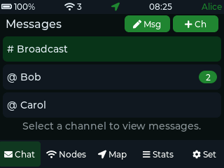</td>
<td align="center" width="33%">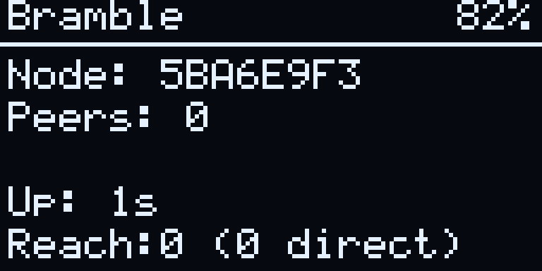</td>
<td align="center" width="33%">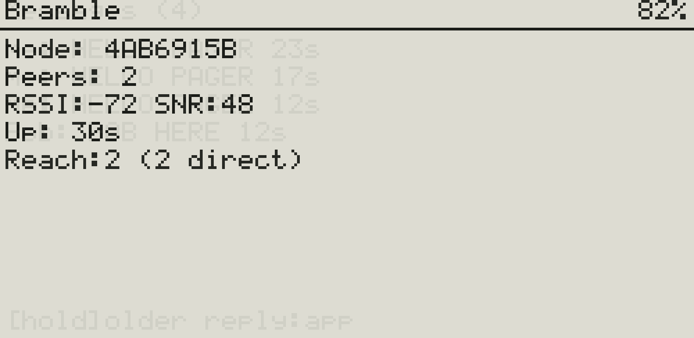</td>
</tr>
<tr>
<td align="center"><b>T-Deck Plus</b> 320x240 color, LVGL UI. Boots into the Messages list.</td>
<td align="center"><b>Heltec OLED</b> 128x64 monochrome, text UI. The status home screen.</td>
<td align="center"><b>Pager v1</b> (alpha) 250x122 e-paper, text UI. The status home screen.</td>
</tr>
</table>

The T-Deck Plus is the full-featured handset: a color touchscreen plus
keyboard and trackball, running the LVGL graphical UI. The Heltec OLED and the
Pager run the same compact text UI on much smaller monochrome panels, so their
screens share a layout and a navigation model (one button cycles screens).

## T-Deck Plus (320x240 color, LVGL)

Captured from real hardware on the bench. The device boots into Messages, so
that is its home screen. Navigation is the trackball (two focus zones: content
and the bottom nav bar) plus the keyboard.

| Screen | |
| --- | --- |
| **Messages** |  |
| **Chat thread** | 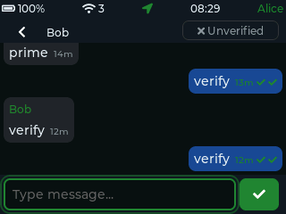 |
| **Nodes** | 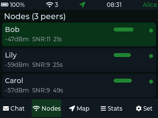 |
| **Stats** | 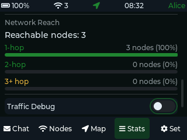 |
| **Settings** | 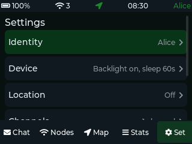 |

Messages lists the Broadcast channel and the direct-message threads (here, DM
threads with Bob and Carol, with an unread badge). Opening a thread shows the
conversation with per-message delivery ticks and the peer's verification
state. Nodes is the live neighbor list with RSSI and SNR. Stats is the network
reach summary (how many nodes are reachable, and in how many hops). Settings is
the configuration hub (identity, device, location, channels, radio,
connectivity).

The **Map** screen is intentionally omitted here. On real hardware it renders
the device's live GPS position as numeric coordinates, and the two bench
T-Decks are sitting at a real location. The LVGL build has no runtime toggle to
force a placeholder position without rebooting the node (which would disrupt
the live bench), so rather than publish a real location, the map is left out.
The Pager and Heltec GPS screens below stand in for the location UI, with safe
placeholder coordinates.

## Heltec OLED (128x64 monochrome, text UI)

Rendered from the real firmware in the emulator (the SSD1306 128x64 profile).
One button cycles the screen ring: Main, Messages, Nodes, Stats, GPS, Settings.
Images are upscaled 6x from the native 128x64 for viewing; the source panel is
exactly 128x64.

| Screen | |
| --- | --- |
| **Main** |  |
| **Messages** | 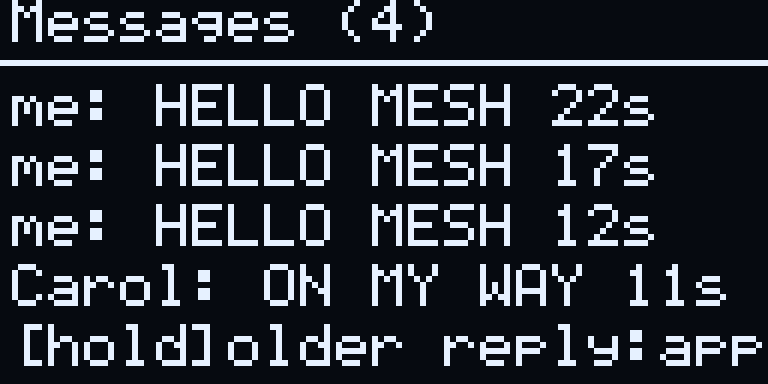 |
| **Nodes** | 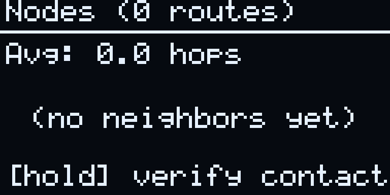 |
| **Stats** | 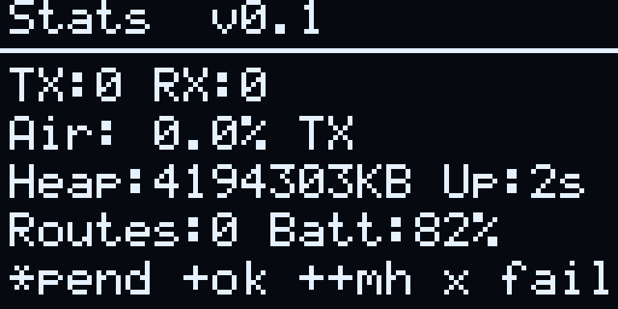 |
| **GPS** | 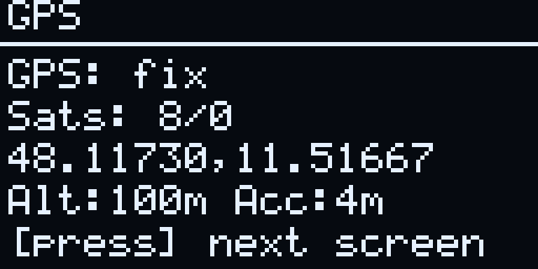 |
| **Settings** | 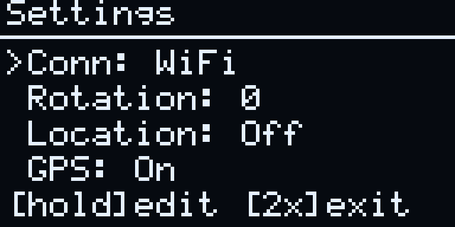 |

## Pager v1 (250x122 e-paper, text UI)

The Pager is an early, alpha-stage device. Its screens are rendered from the
real firmware in the emulator (the SSD1680 250x122 e-paper profile), through
the same screen ring as the Heltec. Images are upscaled 6x from the native
250x122; the source panel is exactly 250x122.

Several captures show heavy ghosting: text from previously displayed screens
remains overlaid on the current one. On the Settings capture this makes the
middle rows genuinely hard to read, with "Rotation: Off" rendering over ghosted
digits from the GPS screen. This is real e-paper partial-refresh behavior
rather than a capture or rendering artifact, and it is what the device
currently looks like in that state, which is why the images are published
as-is. It is a display defect worth fixing rather than a documentation
problem: the pager screen ring never issues a full-panel refresh to clear
accumulated ghosting when switching screens.

| Screen | |
| --- | --- |
| **Main** |  |
| **Messages** | 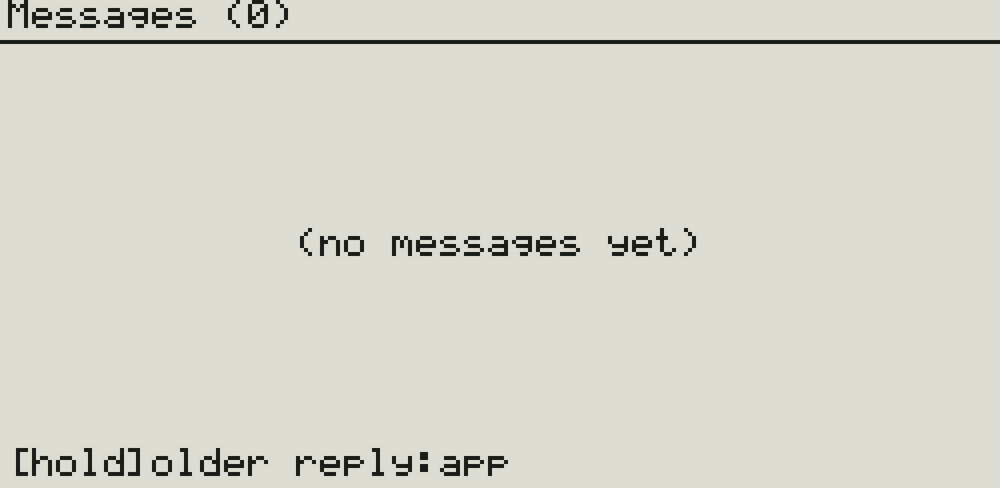 |
| **Nodes** | 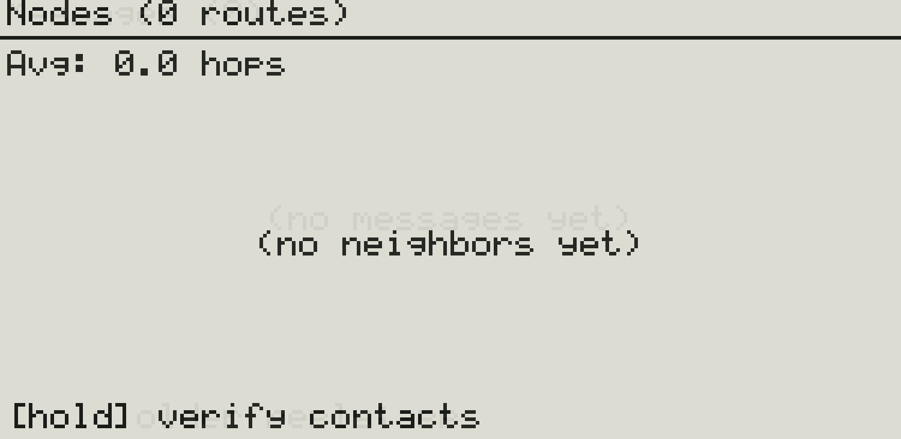 |
| **Stats** | 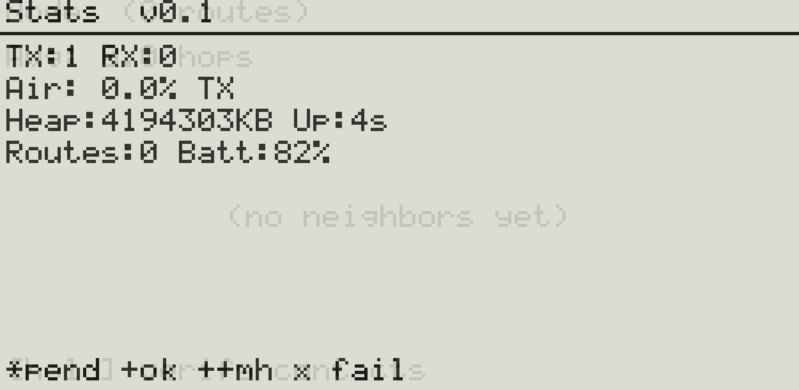 |
| **GPS** | 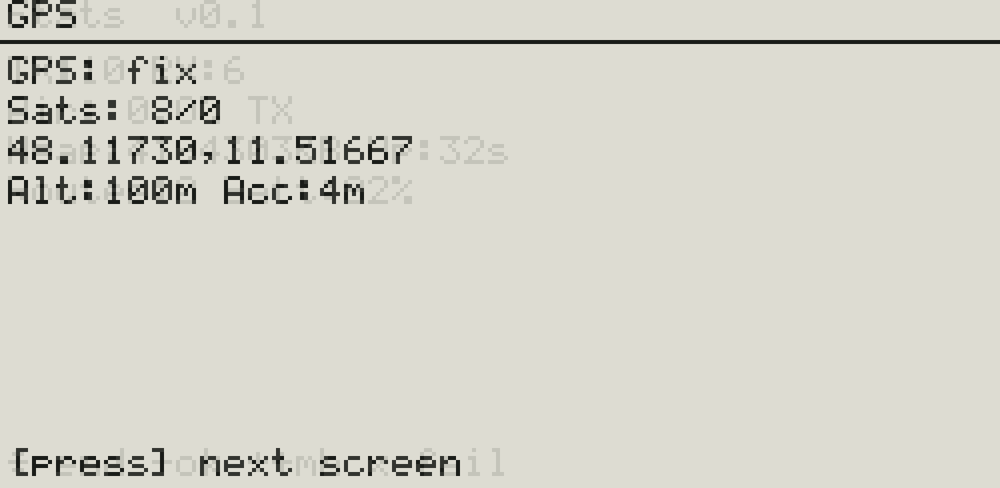 |
| **Settings** | 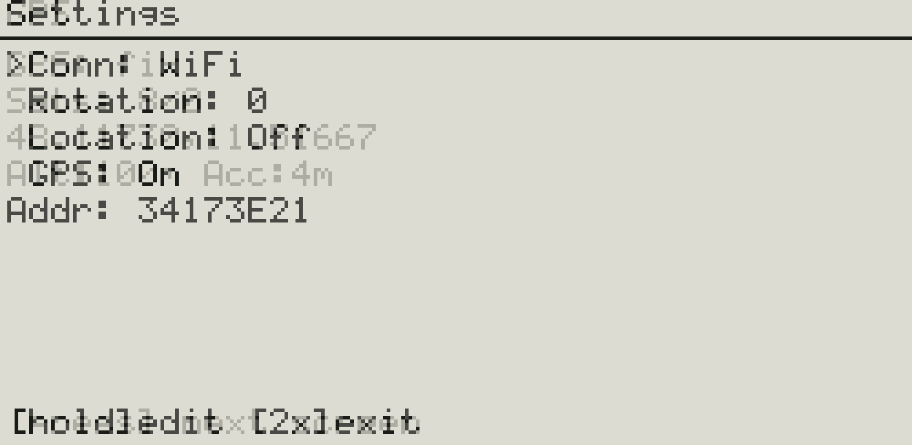 |
