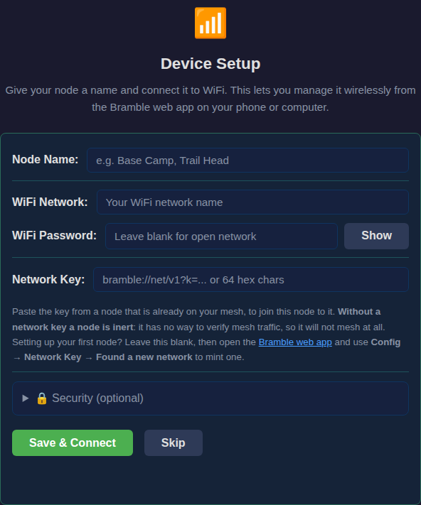
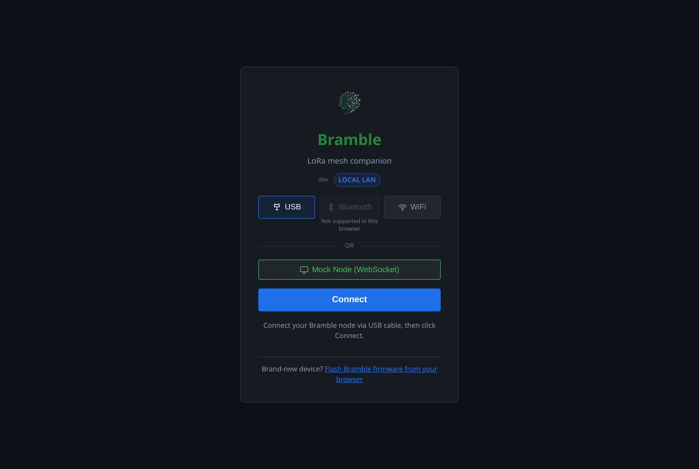
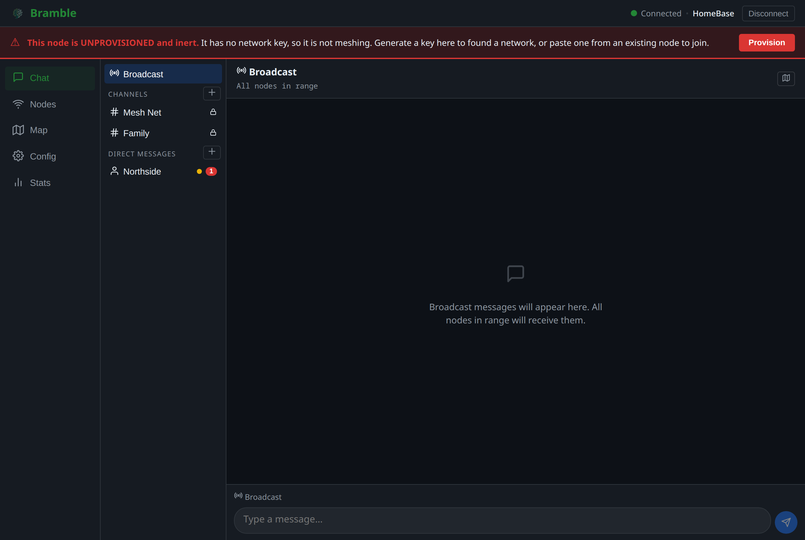
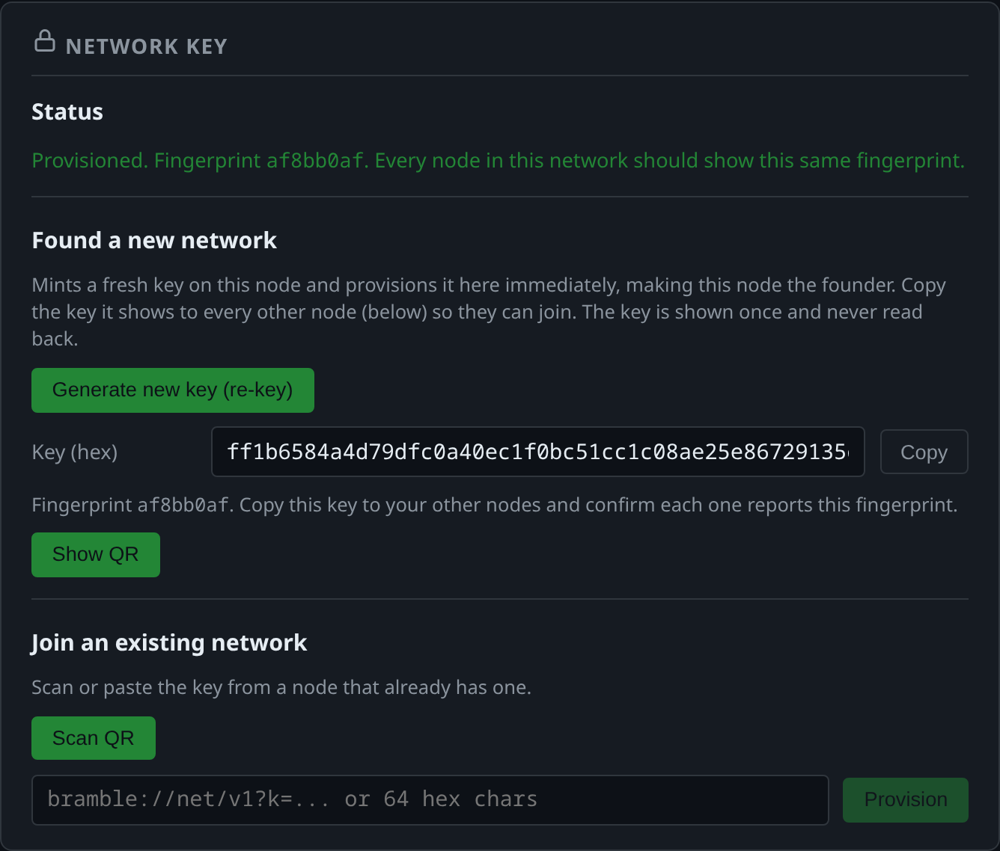
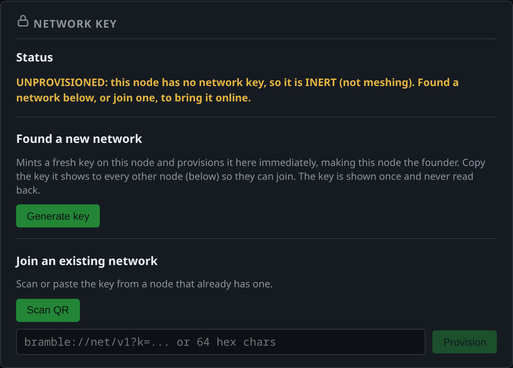
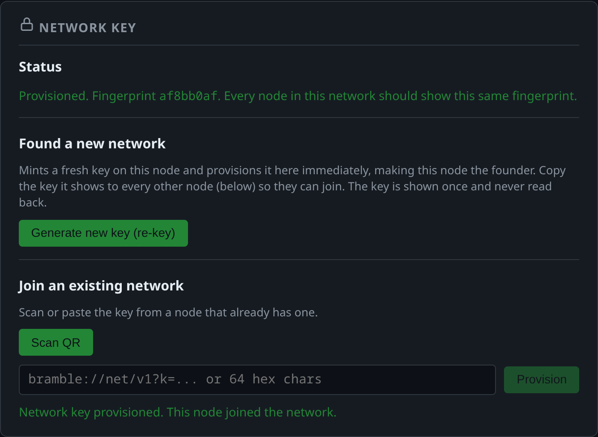

# Getting Started: Your First Mesh

This is the zero-to-first-message path: flash a node, connect the web client,
understand why a fresh node is silent, found a network, join a second node to
it, confirm the two converged, and send a message. Each step links the
reference doc that owns the detail rather than duplicating it.

A mesh needs at least two nodes to be a mesh, so this walkthrough uses two.
Everything through step 4 applies to a single node; step 5 is where the second
one joins. If you have only one node right now, stop after step 4 and come
back.

**What you need:** two supported boards (see the hardware table in the
[README](../README.md)), USB cables, and a Chrome or Edge browser (Web Serial
is required for browser flashing and USB connections; Firefox and Safari do
not implement it).

**No boards yet?** [playground.md](playground.md) is the try-before-hardware
path: one command boots three pagers of real firmware on a simulated ether in
your browser and walks the same ground this page does (provisioning, a relayed
message, safety-number verification, delivery confirmation). The radio is a
model, so it is a way to learn the product, not a substitute for a bench.

## 1. Flash the firmware

Two ways to get firmware onto a device:

- **Browser flashing (no toolchain).** The
  [web flasher](https://bramblemesh.org/web-flasher/) flashes a device over
  USB straight from the browser. After flashing it offers a Device Setup step
  covering node name, WiFi, network key, and (under Security) the RPC auth
  token.
- **From source.** Build and flash with the board-aware scripts documented in
  [BUILDING.md](BUILDING.md). The short version:

  ```bash
  # from the root of your bramble checkout, with ESP-IDF activated
  bash scripts/flash.sh local heltec-v3 build
  bash scripts/flash.sh local heltec-v3 flash /dev/ttyUSB0
  ```

  Use `tdeck-plus` instead of `heltec-v3` for a T-Deck Plus. Board-specific
  profiles and USB-port notes are in [BUILDING.md](BUILDING.md).



**Leave the Network Key field blank on this first node.** You do not have a
key yet; step 4 mints one. The flasher deliberately offers only the join half
of provisioning, because founding a network means minting a secret that is
never recoverable from a device afterwards, and that belongs in the web app
where the QR code, the copy-confirm, and the re-key guard live.

At the end of this step the node boots, but it is not part of any mesh.
Step 3 explains why.

## 2. Connect the web client

The [web client](../webapp/README.md) is where you provision and operate a
node. It connects three ways:



- **USB (serial).** A direct serial connection, and the easiest one for a node
  you just flashed. Serial needs no auth token by design: physical access to
  the device is the trust bootstrap.
- **WiFi (WebSocket).** Enter the node's address (for example
  `ws://192.0.2.100/ws`) and its auth token in the WiFi connection dialog.
- **BLE.** Bluetooth to a nearby node; the app remembers the per-device token
  in its device book.

For a brand-new node, use USB. A fresh node has no WiFi credentials, so there
is nothing for the WiFi path to connect to yet.

**Getting a node onto your WiFi.** The web flasher's Device Setup step can do
this at flash time. Otherwise, connect over USB or BLE and call
`bramble.setWifiConfig` with your
network's SSID and password (see [api/rpc.md](api/rpc.md)); the password
is write-only and is never echoed back by this or any other RPC. There is no
live reconfigure path, so the response reports `applied: "reboot_required"`:
follow up with `bramble.reboot` to apply the new credentials. The same thing
is available from the serial console with `wifi set <ssid> <pass>`.

Where the auth token comes from: on first boot the firmware generates a random
token and stores it in NVS. WiFi and BLE require it; retrieve it over USB with
`bramble pair`, or read it from the serial boot log the first time it is
generated. Full detail, including the browser origin allowlist and how to set
or disable a token, is in [auth.md](auth.md). Enter the token in the **Auth
Token** field of the WiFi connection dialog.

## 3. Why the node is silent: fail-closed by default

A freshly flashed node is **unprovisioned and inert**. There is no built-in
default network key, so the node fails closed: `network_key_get()` fails,
every control-plane verifier (RREP, RERR, ACK, delivery receipt, beacon)
rejects before comparing, and the node neither emits nor accepts authenticated
control-plane traffic. It will not mesh until you give it a real per-fleet key.

You do not have to guess at this. When you connect the web client to an
unprovisioned node it shows a prominent banner across the top of the app:



The banner has a **Provision** button that jumps to the Config tab. It
disappears the moment a key is set. This fail-closed posture is deliberate:
an unprovisioned node cannot be tricked into forging or accepting control
traffic. See [network-key-provisioning.md](network-key-provisioning.md) for
the full behavior.

## 4. Found your network on the first node

The network key is the shared symmetric key behind the control-plane HMACs.
Provisioning is the step that takes a node from inert to meshing. Click
**Provision** in the banner, or open **Config -> Network Key**. On a fresh
node the Status line says so plainly:


Under **Found a new network**, click **Generate key**. The device mints an
entropy-gated 32-byte key, provisions itself with it atomically, and returns
the key once. This node is now the founder:



Three things to do before you move on:

1. **Record the key out of band**, with **Copy** or **Show QR**. The key is
   minted on the device and never read back: this is the only copy that will
   ever exist. If you lose it you cannot recover it from the node, and your
   only option is to found a new network and re-join every node.
2. **Note the fingerprint** (`SHA256(key)[0:4]`, 8 hex chars, `af8bb0af` in
   the screenshot above). You will compare every other node against it.
3. Notice the banner is gone. This node is now meshing.

## 5. Join your second node

Flash the second node exactly as in step 1, then connect the web client to it
over USB. It shows the same UNPROVISIONED banner, because it has no key yet.

Open **Config -> Network Key** on this second node and go to **Join an
existing network**:



Either click **Scan QR** and scan the founder's code, or paste the founder's
key (the `bramble://net/v1?k=...` string, or the bare 64 hex characters) and
click **Provision**. You can also do this during flashing, by pasting the key
into the web flasher's Network Key field in step 1.



**Now compare the fingerprints.** The joined node reads `af8bb0af`, the same
as the founder. That match is what tells you the two nodes hold the same key
and will route for each other. A node still reporting `Unprovisioned` is not
part of the authenticated control plane and cannot route for the fleet, no
matter what firmware it is running.

Repeat this step for every additional node. Past a handful of nodes, doing
this by hand gets tedious: `bramble netkey generate` and `bramble netkey
provision` do the same two steps from a shell, and `bramble netkey status`
checks convergence. The full fleet procedure, what a matching fingerprint does
and does not prove, and how re-keying partitions a fleet are in
[network-key-provisioning.md](network-key-provisioning.md).

What a shared network key does and does not buy you: it excludes outsiders
and closes replay of captured control messages, but every holder of the key
is an insider and can still forge control-plane MACs on behalf of any other
holder. The key proves fleet membership, not per-node identity. Step 5 is how
you narrow that further.

## 6. Optional: set up a trust anchor and enroll the node

A network key admits members but does not stop a member from minting extra
identities (a Sybil). If you want to close Sybil identity minting on your
fleet, set up a per-fleet **trust anchor**: an operator-held Ed25519 keypair
that endorses each member's identity. An anchored node only pins peers
carrying a cert the anchor signed, so an un-admitted Sybil cannot get pinned.
This is opt-in per fleet.

The short version, from **Config -> Trust Anchor**:

1. **Generate anchor** draws a fresh seed in your browser and shows a backup
   string. The seed is not saved or used until you click **I have saved this
   backup**, so record the backup offline first. The seed never leaves your
   browser and is never sent to a node.
2. **Provision anchor to this node** sends the anchor's public key to the node
   (`bramble.setAnchor`).
3. **Enroll this node** reads the node's identity key (`bramble.getIdentity`),
   signs a cert locally, and applies it (`bramble.setEndorsement`); the status
   refreshes to Endorsed. For a node you are not connected to, use **Show my
   identity** on that node and **Sign cert** / **Apply an endorsement** to move
   the identity out and the cert back as share strings.

Honest residuals, in the same breath: a compromised endorsed insider stays a
valid member (endorsement is admission control, not behavioral trust), the
anchor seed is the fleet's trust root and whoever holds it can admit any node,
and v1 certs are permanent with no active revocation. The full ceremony,
custody duties, and residuals are in [trust-anchor.md](trust-anchor.md).

## 7. Send your first message and read the delivery status

Both nodes are now on the same key, so they will route for each other. Power
them both on within radio range, open the Chat view on one, and send a
message. Each sent message carries a delivery status indicator so you know
what actually happened rather than fire-and-forget:

- **Queued** / **Sending** / **Sent to next hop**: the message is in flight and
  not yet confirmed.
- **Delivered**: the acknowledged tiers (Normal and Critical) confirmed
  delivery back to you.
- **Failed**: the message was not delivered after its retries.
- **No confirmation yet**: sent, but no acknowledgement has arrived (expected
  for broadcast, which is fire-and-forget).

Delivery confirmation applies to the acknowledged reliability tiers; broadcast
messages are fire-and-forget and are not individually confirmed. See
[webapp/chat.md](webapp/chat.md) for current chat behavior and
[SECURITY-MODEL.md](SECURITY-MODEL.md) for what is and is not protected.

## 8. Keep it updated

A node on WiFi installs new firmware over the air from the web client, under
**Config -> Device Management -> Firmware Update**. No cable, no toolchain,
and the update origin is already configured.
[updating-your-node.md](updating-your-node.md) walks the whole journey and
covers the two things that surprise people: a node only accepts images signed
by the key that signed the firmware it is running (so a node you flashed from
source will not take official builds), and going back to an older version
needs the **Allow downgrade** checkbox.

That is a two-node mesh from zero to a confirmed message. Adding a third node
is step 1, step 2, and step 5 again: flash it, connect it, join it to the same
key, and confirm it reports the same fingerprint. From here,
[network-key-provisioning.md](network-key-provisioning.md) covers the
fleet-scale procedure and re-keying, [trust-anchor.md](trust-anchor.md) covers
closing Sybil identity minting, and
[SECURITY-MODEL.md](SECURITY-MODEL.md) is the honest threat model.
