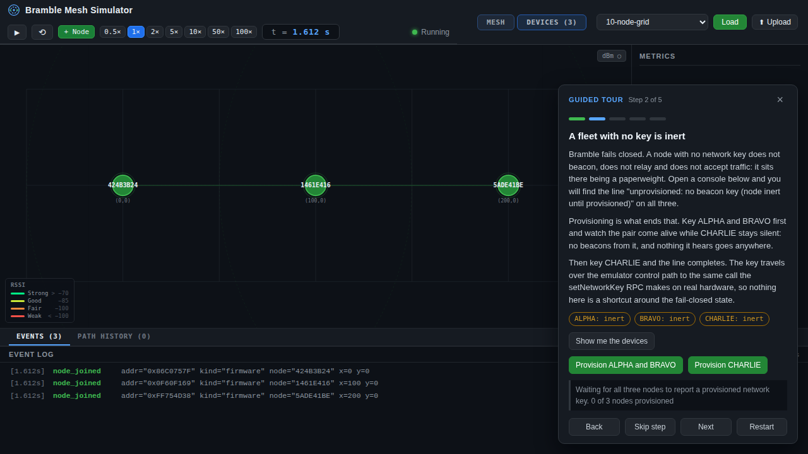
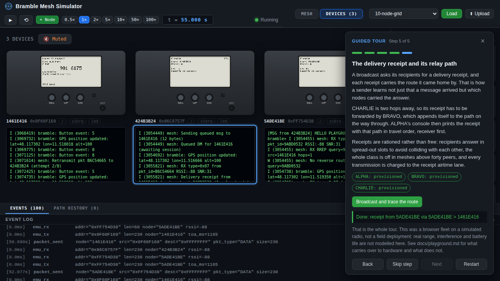

# The playground: first contact without hardware

The playground boots a small Bramble fleet in your browser and walks you
through the parts of the product that are hard to explain and easy to show: a
node that refuses to do anything until it is provisioned, a message that has to
be relayed to arrive, a direct message whose safety number you compare on the
device, and a delivery receipt that names the route it came home by.

It exists so that "what is this actually like" has an answer that costs one
command and no hardware.



## What is real and what is not

**The firmware is real.** Each pager is `main/` plus `components/` compiled for
ESP-IDF's Linux target and run as an ordinary process: the same mesh stack,
routing, crypto, message store and screen-drawing code that ships to an
ESP32-S3. Nothing in the playground reimplements protocol behavior in
JavaScript.

**The radio is simulated.** gosim models one LoRa channel: range, time-on-air,
collisions, half duplex and listen-before-talk. Nodes hear each other only when
that model says a frame reached them, which is why the geometry below decides
what is reachable.

**A browser fleet is not a field deployment.** Terrain, antennas, interference
from everything else on the band, battery life, temperature and the difference
between a bench and a hillside are not modelled here. The playground is
faithful about protocol behavior and honest about being a model of the radio.
For measured numbers see
[results/simulation-2026-07-honest-baseline.md](results/simulation-2026-07-honest-baseline.md),
which is labelled as simulation for the same reason.

**The network key the tour provisions is published.** It is the same demo key
the other `emu-*` scenarios use, sitting in a source file. It protects nothing
and is not an example to copy: a real fleet mints its own and hands it out as
described in
[network-key-provisioning.md](network-key-provisioning.md).

## Running it

Local toolchain (ESP-IDF's Linux target, Go, Node; `make check` tells you what
is missing):

```bash
cd emulator
make playground
```

Docker, with nothing installed but Docker:

```bash
cd emulator
docker compose --profile playground up playground
```

Then open the URL the command prints: `http://localhost:3000/` for `make
playground` (override with `make playground PORT=3010`), or
`http://localhost:3005/` for the container. The tour appears on its own; the
fleet is already booting behind it.

Both routes run `gosim --playground`, which loads the `emu-playground` scenario
at startup and tells the UI to show the tour. To get the tour on a stack you
started some other way (`make run`, `docker compose up`), add `?tour=1` to the
URL and load the `emu-playground` scenario from the dropdown; `?tour=0` turns
it off again.

The tour is dismissible and resumable: the close button collapses it to a
"Resume the guided tour" pill, and its position survives a reload. Reloading
the page does not disturb the fleet, which keeps running: the broker replays
the nodes that have joined and the last screen each pager painted, so a fresh
browser sees the fleet as it stands rather than an empty map.

## The fleet

Three pagers named ALPHA, BRAVO and CHARLIE, in a line at x = 0, 100 and 200,
with a 150-unit radio range (`simulator/scenarios/emu-playground.json`):

```text
ALPHA ----100---- BRAVO ----100---- CHARLIE
  |                                     |
  +--------------200-------------------+   out of range (> 150)
```

ALPHA and BRAVO can hear each other; BRAVO and CHARLIE can hear each other;
ALPHA and CHARLIE cannot hear each other at all. Every ALPHA-to-CHARLIE
exchange therefore has to cross BRAVO, in both directions. That is what makes
the relay in step 3 and the relay path in step 5 facts rather than diagrams.

The fleet boots **unprovisioned**. It is the only emulator scenario that does,
and it is deliberate: every other `emu-*` scenario hands each node a network
key at boot because a headless assertion needs a meshing fleet immediately,
while here the fail-closed state is the first thing the tour has to show. No
node has `EMU_AUTO_SEND` either, so every message on the ether is one you
originated. What a keyed node sends without being asked is the firmware's own
control plane on its shipped cadence: a beacon every 15 s, and an identity
attestation once it has a key and every fifteen minutes after that
(`main/mesh_beacon.c`). The emulator control path schedules nothing of its own,
so a provisioned playground node behaves exactly like a bench node keyed over
the `bramble.setNetworkKey` RPC.

## What each tour step demonstrates

**1. What you are looking at.** Orientation: real firmware, simulated radio,
and the geometry above. It completes when all three nodes have booted, attached
to the ether and opened the control path the tour drives them through.

**2. A fleet with no key is inert.** Bramble fails closed. With no network key
a node does not beacon, does not relay and does not accept traffic; all three
consoles carry the line `unprovisioned: no beacon key (node inert until
provisioned)`. The step provisions ALPHA and BRAVO first and leaves CHARLIE
inert on purpose, so the difference is visible on one screen, then keys
CHARLIE. The key goes to `network_key_set_from_hex`, the same component call
the `bramble.setNetworkKey` RPC reaches on a real device, so nothing here
routes around the fail-closed state.

**3. A channel message, relayed.** ALPHA broadcasts on the public channel.
BRAVO decrypts it and rebroadcasts it, and CHARLIE, which cannot hear ALPHA,
prints the text it could only have received from BRAVO. A broadcast is
Bramble's lowest reliability tier: no acknowledgement and no retransmission, so
a frame that collides with another node's transmission is gone and sending it
again is the only recovery. The step says so, because that is what the tier
means.

**4. A direct message, and the safety number.** A DM is not a channel message:
ALPHA and BRAVO run a key exchange (Critical tier, eight retries from a 3 s
base) and then talk inside a session only those two can read. Encryption alone
does not say who is on the other end, so the step goes on to the 7-digit safety
number: it asks ALPHA to announce its identity, which is what lets BRAVO pin
ALPHA's keys, and then has you walk BRAVO's own screen to the peer entry, read
the seven digits and confirm them with the device's two-step press. The node
records the confirmation the same way it does when a person does it on
hardware.

**5. The delivery receipt and its relay path.** A broadcast asks its recipients
for a delivery receipt, and each receipt carries the route it travelled.
CHARLIE's receipt has to be forwarded by BRAVO, which appends itself on the way
through, so ALPHA's console prints the receipt with a two-hop path in travel
order, receiver first. Receipts are rationed rather than free: recipients
answer in spread-out slots, the whole class is off in meshes above forty peers,
and every transmission is charged to the receipt airtime lane.



Steps advance on their own when the firmware's own console output shows the
thing happened, and every step can be skipped, so a fleet that will not
cooperate never traps you.

## How the screenshots on this page were made

Both images are real captures of a real run, taken by the browser test that
gates this feature (`emulator/e2e/specs/playground-tour.spec.ts`) and written
straight into `docs/images/`, so they cannot drift from what the tour actually
renders. The test boots the same stack `make playground` does (gosim plus three
firmware node processes plus the built UI), drives the tour through all five
steps, and screenshots the viewport at two points: after the fleet attaches
(the fleet view above) and after a two-hop delivery receipt reaches ALPHA (the
milestone view). Regenerate them with:

```bash
cd emulator && make e2e
```

This is the same convention [device-screens.md](device-screens.md) uses for the
emulator-rendered device screens.

## What gates it

- `bash emulator/ci/run_scenarios.sh` runs the `emu-playground` scenario
  headlessly and asserts the fail-closed state as an absence of air: three
  nodes attach, each reports it has no beacon key, each opens its control
  path, and the broker records zero transmissions for the whole run.
- `emulator/e2e/specs/playground-tour.spec.ts` drives the whole tour in a real
  browser against real firmware processes, asserting each step twice over: once
  against the app's own tour state and once against the raw firmware console
  the broker streams.
- `cd simulator/ui && npx vitest run` covers the tour's step predicates, its
  console scanning and its resumable position.
